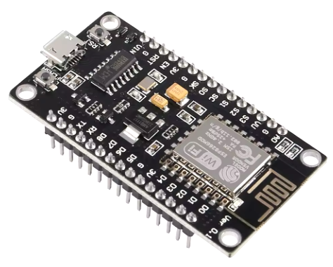
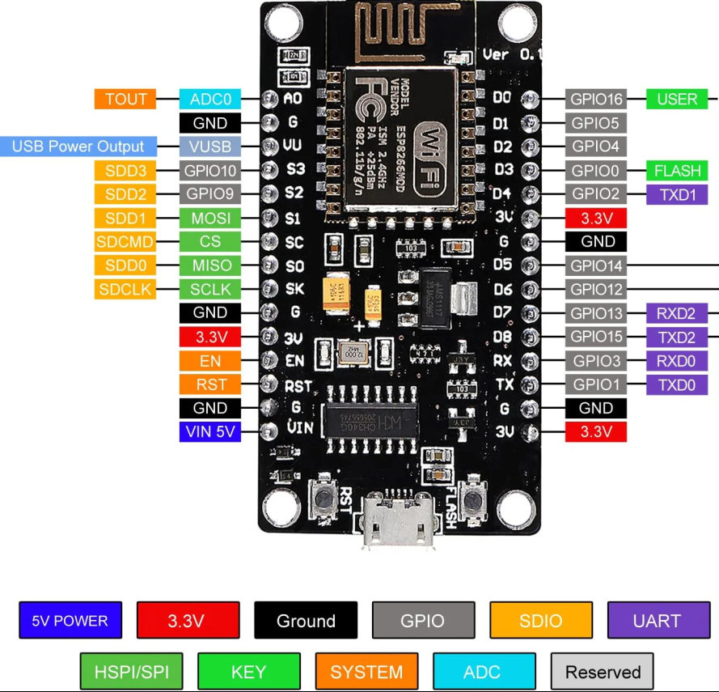
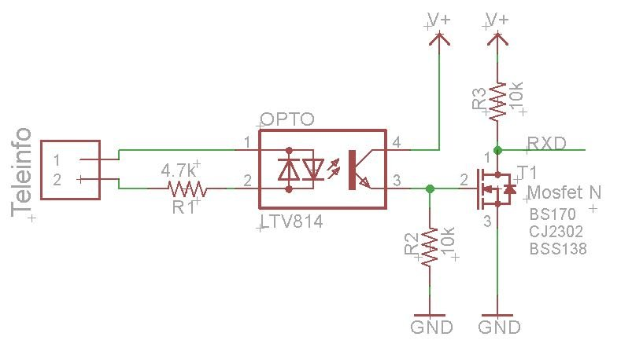
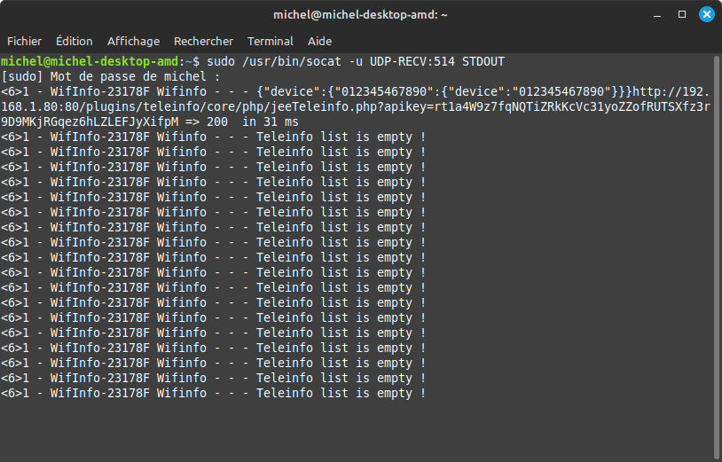
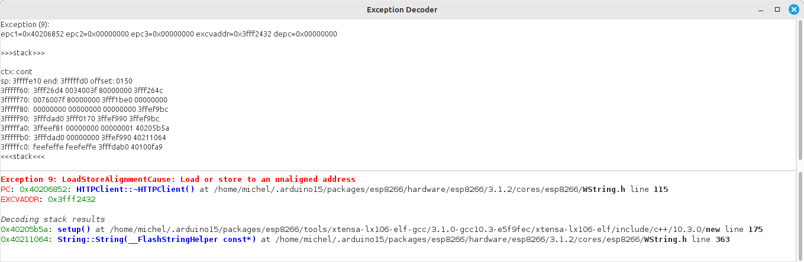

# Teleinfo Universal Library
This is a fork of Teleinfo Universal Library for the ESP8266 MCU
This is a generic Teleinfo French Meter Measure Library
- Initial Github source : <https://github.com/hallard/LibTeleinfo>
- Modified Github source : <https://github.com/Doume/LibTeleinfo>
- Modified Github source : <https://github.com/theGressier/LibTeleinfo/tree/syslog>
- Modified Github source : <https://github.com/Duglof/LibTeleinfo>
- Modified Github source : <https://github.com/Davcail/LibTeleinfo-syslog-mqtt>

Sélection du mode (TINFO_MODE_HISTORIQUE par défaut):
  - TInfo.init(TINFO_MODE_HISTORIQUE); 
   ou 
  - TInfo.init(TINFO_MODE_STANDARD); 

# Wifinfo

  exemples/Wifinfo

Le serveur Web Wifinfo est connecté:
  - en Wifi à votre réseau local
  - au compteur Linky via l'interface OPTO à I1 et I2

Wifinfo permet par configuration d'activer les fonctions suivantes:
  - Envoie périodique des données au plugin Teleinfo de votre Jeedom
  - Envoie périodique des données au serveur emoncms
  - Envoie de données à un serveur MQTT (Jeedom, HomeAssistant ou autre)
  - Envoie de données à un serveur web via une requète http GET

Wifinfo est aussi un serveur json qui permet:
  - Retourner les données de téléinformation du Linky (http://192.168.1.x/json)
  - Retounner les données système ((http://192.168.1.x/system.json))

Wifinfo dispose d'une interface d'administation 
  - [Téléinformation](docs/Wifinfo-Teleinformation.png): Visualisation des données du linky (ADCO, HCHC, ...)
  - Configuration: [Réseau Wifi](docs/Wifinfo-configuration-generale.png), [Mqtt](docs/Wifinfo-configuration-mqtt.png), [Emoncms](docs/Wifinfo-configuration-emoncms.png), [Jeedom](docs/Wifinfo-configuration-jeedom.png), [Http Request](docs/Wifinfo-configuration-http-request.png), [Avancée](docs/Wifinfo-configuration-avancee.png)
  - [Système](docs/Wifinfo-systeme.png) : Affichage des informations système ( Version, Réseau, Erreurs, Options de compilation, Mémoire)
  - [Fichiers](docs/Wifinfo-fichiers.png) : Affichage des informations du système de fichiers (Liste, Taille, Espace libre)
 
  - Linky mode Historique et mode Standard (option de compilation Wifinfo.h)
  - Compatible jeedom v4 / clé API plugin Teleinfo 64 caractères
  - Beta version de mqtt

Wifinfo : Configuration Wifi

Depuis votre téléphone portable :
- Se connecter au réseau Wifinfo-XXXXXX
- Navigateur (chrome ou autre) url : http://192.168.4.1
- Sélectionner l'onglet Configuration
- Réseau Wifi : Mettre le SSID
- Clé Wifi    : Mettre le mot de passe de votre réseau Wifi
- Clicker sur Enregistrer
- Déployer Avancée
- Cliquer sur Redémarrer Wifinfo
- Wifinfo se connectera à votre réseau Wifi
- Accéder à votre box pour connaître sa nouvelle adresse IP

# Modification par dugolf (version 2.0.0)
- Merge avec https://github.com/hallard/LibTeleinfo/tree/master
  - Integration nouvelle LibTeleinfo compatible mode Historique et mode Standard
    - Presque identique à https://github.com/arendst/Tasmota/tree/development/lib/lib_div/LibTeleinfo
- Compile en Linky mode Historique et Linky mode Standard
  - Configuration dans Wifinfo.h : 
    - #define LINKY_MODE_STANDARD
    - Si le define est commenté alors mode Historique
- Affichage sur la page web dans l'onglet Système
  - Les options de compilation
  - Les compteurs d'erreur (checksumerror,framesizeerror,frameformaterror,frameinterrupted)
- Ajout d'une beta version de MQTT
   - Envoie de messages de log démarrage (Version, Adresse IP, Date Heure)
   - Envoie immédiat des données de Téléinformations ajoutées ou modifiées (DataCallback()

# Modifications par dugolf (version 1.0.8)
- Wifinfo.h : #define WIFINFO_VERSION "1.0.8"
- library.json : "version": "1.0.8"
- library.properties : version=1.0.8
- Teleinfo clé api 64 caractères
  - config.h : #define CFG_JDOM_APIKEY_SIZE  64
  - data : index.htm.gz : index.htm : id="jdom_apikey" : maxlength="64"
  - Wifinfo.ino : char buff[300] //To format debug strings but also use to format jeedom request
- Correction erreurs de compilation (LibTeleinfo.h / LibTeleinfo.cpp)
  - void TInfo::process (char c); : retourne void
  - void TInfo::clearBuffer(); : retourne void
  - ValueList * TInfo::valueAdd; : return NULL à la fin de la méthode
- Warning C++ conversion const char * en char * (Wifinfo.ino)
  - add void Myprint(const char *msg)

# Modifications par theGressier (version 1.0.7)
- Modification de l'envoi des données à Jeedom suite à la mise à jour du plugin Teleinfo en v4 (changement API, POST JSON)
- Reconnect WiFi automatically after incident

# Modifications par Doume (version 1.0.6) branche 'syslog' :

- Permettre l'envoi des messages de debugging à un serveur rsyslog du réseau local

   les paramètres peuvent être configurés via l'interface Web, onglet 'Configuration'
   panel 'Avancée'
   
   Il suffit de laisser le paramètre 'Syslog host' vide, pour désactiver cette fonction.
   Les envois sur le réseau utilisent le protocole UDP pour alimenter le serveur
   distant
   
   Pour compiler avec l'option SYSLOG, vous devrez installer la librairie Syslog-master.zip
   qui se trouve dans le répertoire 'librairie', dans votre environnement Arduino IDE
			
# Modifications par Doume (version 1.0.5a) branche 'static' :

- Ajout de la gestion d'un contact sec, dont l'état peut être remonté vers Domoticz
     exemple : le compteur EDF est souvent près du portail, donc on peut notifier
     			l'état ouvert/fermé du portail en utilisant Wifinfo
			
# Modifications par Doume (version 1.0.5) branche 'static' :

- Add support for request /emoncms.json

        return a json list formated to interface emoncms server from a 3rd party 
        That allow to don't activate emoncms http client inside Wifinfo module
	
- Add possibility to compile a version of sketch for module not connected to EDF counter

        Activate #define SIMU into Wifinfo.h, to obtain a version which will create
         2 variables and update one of them each second, to verify package
	 
- Add a check on variable names, and force a reinit of LibTeleinfo interface if an
  alteration is detected (each restart is counted, and displayed in 'system' page )
  
- Change library LibTeleinfo.cpp, to don't use anymore malloc/free system APIs

		Variables are now stored in static table, allocated on start
		
			50 entries max, name length 16 bytes max, value length 16 bytes max
			
		To use this library version :
		
			First, backup your old version of LibTeleinfo....
			
			copy files src/LibTeleinfo.cpp and src/LibTeleinfo.h into your Arduino
			environment (generally ~/Arduino/libraries/LibTeleinfo-master/src )
			before to compile sketch

# Added features :
- Add possibility to configure HttpRequest to send parameters/values to Domoticz
- Add all possible variable as listed below : 
- Add some informations to 'System' page, like Wifi link quality, Wifi network name, and MAC address

Ces différents messages donnent les indications suivantes en fonction de l’abonnement souscrit (Base, HP/HC, EJP, Tempo):
- N° d’identification du compteur : ADCO (12 caractères)
- Option tarifaire (type d’abonnement) : OPTARIF (4 car.)
- Intensité souscrite : ISOUSC ( 2 car. unité = ampères)
- Index si option = base : BASE ( 9 car. unité = Wh)
- Index heures creuses si option = heures creuses : HCHC ( 9 car. unité = Wh)
- Index heures pleines si option = heures creuses : HCHP ( 9 car. unité = Wh)
- Index heures normales si option = EJP : EJP HN ( 9 car. unité = Wh)
- Index heures de pointe mobile si option = EJP : EJP HPM ( 9 car. unité = Wh)
- Index heures creuses jours bleus si option = tempo : BBR HC JB ( 9 car. unité = Wh)
- Index heures pleines jours bleus si option = tempo : BBR HP JB ( 9 car. unité = Wh)
- Index heures creuses jours blancs si option = tempo : BBR HC JW ( 9 car. unité = Wh)
- Index heures pleines jours blancs si option = tempo : BBR HP JW ( 9 car. unité = Wh)
- Index heures creuses jours rouges si option = tempo : BBR HC JR ( 9 car. unité = Wh)
- Index heures pleines jours rouges si option = tempo : BBR HP JR ( 9 car. unité = Wh)
- Préavis EJP si option = EJP : PEJP ( 2 car.) 30mn avant période EJP
- Période tarifaire en cours : PTEC ( 4 car.)
- Couleur du lendemain si option = tempo : DEMAIN
- Intensité instantanée : IINST ( 3 car. unité = ampères)
- Avertissement de dépassement de puissance souscrite : ADPS ( 3 car. unité = ampères) (message émis uniquement en cas de dépassement effectif, dans ce cas il est immédiat)
- Intensité maximale : IMAX ( 3 car. unité = ampères)
- Puissance apparente : PAPP ( 5 car. unité = Volt.ampères)
- Groupe horaire si option = heures creuses ou tempo : HHPHC (1 car.)
- Mot d’état (autocontrôle) : MOTDETAT (6 car.)

# Hardware
ESP-12E Dev Kit (type NodeMCU 1.0) avec 4 Mo de flash (30 broches)
 

Alimentation de l'ESP : 5 Volt 500mA (200mA mini)
- VIN de ESP au +
- G de ESP au -

Interface compteur Linky by hallard 

Connexions au compteur Linky (il n'y a pas de sens, on peut inverser)
- Connecter Teleinfo 1 et sur I1 du compteur
- Connecter Teleinfo 2 et sur I2 du compteur

Connexions à ESP-12E
- GND : G  de ESP (GND) 
- +V  : 3V de ESP (3.3V)
- RXD : RX de ESP (RXD0 GPIO3)

# Compilation / Téléversement
Utiliser Arduino IDE V1.8.18
Warning : Déconnecter l'interface Linky du RX de l'ESP

- Ajout du type de carte NodeMCU 1.0 (ESP-12E module)

  - Fichier->Preferences : URL de gestionnaire de cartes supplémentaires
    - Ajouter http://arduino.esp8266.com/stable/package_esp8266com_index.json (virgule comme séparateur si plusieurs URL)
    - Cliquer sur OK.

  - Outils->Type de carte 'xxxx'->Gestionnaire de carte
    - Filtrer esp8266
    - esp8266 by ESP8266 community v3.1.2
    - Cliquer sur Installer

  - Outils-> Type de carte 'xxxx'->ESP8266 Boards
    - Sélectionner NodeMCU 1.0 (ESP-12E module)

  - Outils->Port (il faut que ESP-12E soit connecté à l'ordinateur)
    - Sélectionner le port

- Ajout Arduino ESP8266 filesystem uploader v0.5.0
  - Télécharger https://github.com/esp8266/arduino-esp8266fs-plugin/releases/download/0.5.0/ESP8266FS-0.5.0.zip
  - Décompresser l'outils dans le répertoire Arduino ( répertoire qui devrait ressembler à <home_dir>/Arduino/tools/ESP8266FS/tool/esp8266fs.jar)
  - Redémarrer Arduino IDE
  - Dans le menu Outils vous devez avoir 'ESP8266 Sketch Data Upload'

- Ajout de la librairie LibTeleinfo
  - Depuis https://github.com/Duglof/LibTeleinfo
  - Choisir Code->Download ZIP (Choisir le répertoire <home_dir>/Arduino/libraries)
  - Décompresser le ZIP dans ce répertoire

- Ajout des autres librairies nécessaires
  - Syslog-master
    - Decompresser <home_dir>Arduino/libraries/LibTeleinfo/librairie/Syslog-master.zip dans <home_dir>Arduino/libraries
  - NeoPixelBus_by_Makuna V2.8.3 : l'installer depuis l'Arduino IDE

- Ouvrir le projet Wifinfo
  - Fichiers->Exemples->LibTeleinfo
  - Sélectionner 'Wifinfo'

- Compilation
  - Croquis->Compiler

- Téléversement
  - Outils->ESP8266 Sketch Data Upload (cela téléverse le contenu du répertoire data du projet Wifinfo)
  - Croquis->Téléverser

# Tests
Jeedom V4.4.19 : Plugin Teleinfo by Noyax37 V4.8.7

# Debug avec Syslog
- Compiler Wifinfo avec le #define SYSLOG (Winfinfo.h) : Ce qui est fait par défaut
- Configurer Wifinfo
  - Onglet Configuration
  - Déployer ‘Avancée’
  - Rsyslog serveur (IP ou Nom DNS) : Entrer l’IP de votre machine ou vous installerez le logiciel socat (Windows ou Linux) 
  - Rsyslog port : 514
- Installer socat (sur une machine de votre réseau local)
- Ouvrir une fenêtre terminal et lancer 'socat -u UDP-RECV:514 STDOUT'
  - sudo /usr/bin/socat -u UDP-RECV:514 STDOUT (exemple sous linux)
  - Le fenêtre Terminal liste alors tous les messages debug de Wifinfo

# Debug des exceptions
- Ce type de trace ne s'obtient que dans la fenêtre Outils/Moniteur série de l'IDE Arduino
- On ne l'a pas avec SYSLOG
# Exemple de message:

Exception (9):
epc1=0x40206852 epc2=0x00000000 epc3=0x00000000 excvaddr=0x3fff2432 depc=0x00000000

 >>>stack>>>

 ctx: cont

 sp: 3ffffe10 end: 3fffffd0 offset: 0150

 3fffff60:  3fff26d4 0034003f 80000000 3fff264c

 3fffff70:  0076007f 80000000 3fff1be0 00000000

 3fffff80:  00000000 00000000 00000000 3ffef9bc

 3fffff90:  3fffdad0 3fff0170 3ffef990 3ffef9bc

 3fffffa0:  3ffeef81 00000000 00000001 40205b5a

 3fffffb0:  3fffdad0 00000000 3ffef990 40211064

 3fffffc0:  feefeffe feefeffe 3fffdab0 40100fa9

 <<<stack<<<

# Outils à installer

Il faut installer ESPExceptionDecoder V2.0.0 (Les versions ultérieurs non pas fonctionnées)
- https://github.com/me-no-dev/EspExceptionDecoder/releases/download/2.0.0/EspExceptionDecoder-2.0.0.zip
- Télécharger le zip dans Arduino/tools
- Faire Extraite ici
- Il apparaît dans Aduino IDE 1.8.18 Outils/ESP Exception Decoder

# Utilisation
- Il faut absolument compiler votre Croquis (sinon il vous demandera de sélection un fichier elf)
- Ouvrir le fenêtre Outils/ESP Exception Decoder (qui s'ouvrira sans poser de question)
- Et coller dans cette fenêtre le message ci-dessus
- Vous obtiendrez le décodage ci-dessous

- C'est plus clair, le problème est dans le Setup !!!

