# Wifinfo - Présentation et fonctionnalités

Wifinfo est une solution permettant de récupérer et transmettre les données du compteur électrique Linky vers votre système domotique quel qu'il soit (Jeedom, Home Assistant, Domoticz, Mqtt). Il s'adapte automatiquement à votre type abonnement (Base, Heures Creuses, Tempo, Production, EJP) et fournit l'ensemble des informations disponibles.

## Fonctionnalités principales
- Transmission des données Linky vers n'importe quelle plateforme domotique compatible
- 4 modes de transmission simultanés possibles: 
  - Configuration Mqtt : Envoi des données à un serveur Mqtt : Home Assistant
  - Configuration Emoncms : EmonCMS est un serveur open-source de supervision de l’énergie (https://emoncms.org ou instance locale) 
  - Configuration Jeedom : Envoi des données au plugin Teleinfo de Jeedom
  - Configuration Http : Envoi des données en Http : Domoticz
- Aide à la migration : permet d'envoyer simultanément les données vers plusieurs systèmes domotiques
- Accessible directement par nom sur le réseau via mDNS (ex: Si dans l'onglet configuration Nom Réseau = **Wifinfo-23178F**)
  - **http://Wifinfo-23178F.local**
  - **ping Wifinfo-23178F.local**
- Serveur json:
  - Récupération des compteurs du Linky : **http://Wifinfo-XXXXXX/json**
  - Récupération des données de l'onglet Téléinformation: **http://Wifinfo-XXXXXX/tinfo.json**
  - Récupération des données de l'onglet Système : **http://Wifinfo-XXXXXX/system.json**
  - Récupération des données de l'onglet Configuration : **http://Wifinfo-XXXXXX/config.json**
- Mise à jour via Wi‑Fi (OTA – Over‑The‑Air)
- Détection automatique du type d'abonnement
- Interface web intégrée pour la configuration et la visualisation des données
- Compatibilité avec les modes Linky **Historique** et **Standard** (configurable via l'interface WEB )
- Connexion Wi-Fi pour l'intégration dans votre réseau domestique
- Connexion au compteur via les broches **I1/I2** grâce à l'interface 'PtInfo from Charles' (jusqu'à 10 mètres avec un câble téléphonique)
- Alimentation via un simple chargeur de téléphone connecté sur la prise USB du module ESP
- Reconfiguration facile en cas de changement de box internet : Avec votre téléphone portable
  - Se connecter au réseau wifi **Wifinfo-XXXXXX**
  - Accéder via le navigateur internet à http://192.168.4.1
  - Sélectionner le SSID de votre nouveau réseau (affichage automatique des réseaux disponibles)
  - Entrer le mot de passe et cliquer sur 'Enregistrer'
  - Redémarrer Wifinfo
- Compatible avec les modules **ESP8266** et **ESP32** 

## Dépôt Github

Vous pouvez retrouver le projet et installer la version correspondant à votre module ESP en cas de panne.
 https://github.com/duglof/libteleinfo : En cas de panne de votre module ESP vous pouvez installer la même version.

## Flash firmware (backup/restore)
[Lien vers les derniers firmware compilés :]<https://github.com/Duglof/LibTeleinfo/releases/latest>

[Procédure de programmation et de sauvegarde :](./firmwares)

## Connexions
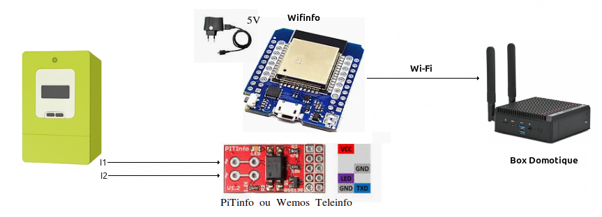

## Écran principal
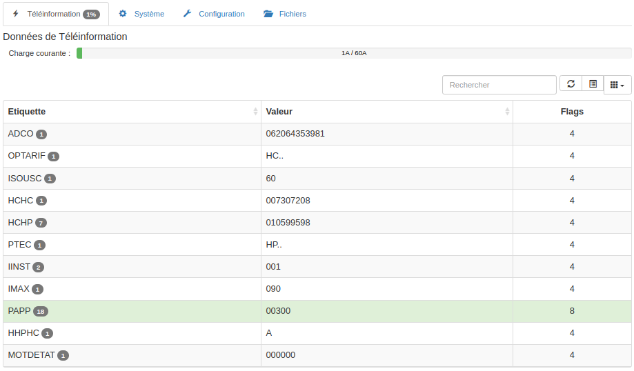

P.S.
Le système de fichier utilisé pour stocker le contenu du répertoire data est au format SPIFFS qui est déprécié.
Si l'utilisation était supprimée, prenez la version V3.1.0 de la branche littlefs.
Elle est identique. La seule différence, c'est le système de fichier.

# Teleinfo Universal Library

This is a fork of Teleinfo Universal Library for the ESP8266 MCU
This is a generic Teleinfo French Meter Measure Library
- Initial Github source : <https://github.com/hallard/LibTeleinfo>
- Modified Github source : <https://github.com/Doume/LibTeleinfo>
- Modified Github source : <https://github.com/theGressier/LibTeleinfo/tree/syslog>
- Modified Github source : <https://github.com/Duglof/LibTeleinfo>
- Modified Github source : <https://github.com/Davcail/LibTeleinfo-syslog-mqtt>

Sélection du mode (TINFO_MODE_HISTORIQUE par défaut):
  - TInfo.init(TINFO_MODE_HISTORIQUE); 
   ou 
  - TInfo.init(TINFO_MODE_STANDARD); 

exemples/Arduino_Softserial_Etiquette : Affiche des informations de téléinformation reçue étiquette par étiquette.

exemples/Arduino_Softserial_Blink : Affiche des informations de téléinformation reçue trame par trame avec clignotement LED court/long si les données ont été modifiés.

# Wifinfo pour ESP32 (mais aussi ESP8266)

Il se trouve dans les exemples de la librairie LibTeleinfo
  exemples/Wifinfo

Le serveur Web Wifinfo est connecté:
  - En Wifi à votre réseau local
  - Au compteur Linky via l'interface OPTO à I1 et I2 (avec 10 mètres de câble téléphone, c'est ok)
  - A une alimentation 5V via le connecteur USB (micro USB ou USB-C ou autre si l'ESP choisi n'a pas de prise USB) 

Wifinfo est compatible avec tous les contrats car il ne fait pas de filtrage sur les données reçues ( BASE, HPHC, TEMPO, etc)

Wifinfo est compatible Linky Mode Historique et Linky Mode Standard (à configurer dans l'interface Web Onglet Configuration : Section Avancée)

Wifinfo peut utiliser le système de fichier SPIFFS ou LittleFS
  - Option de compilation Wifinfo.h : #define WIFINFO_FS_LittleFS
 
Wifinfo permet par configuration d'activer les fonctions suivantes:
  - Envoie périodique des données au plugin Teleinfo de votre Jeedom
  - Envoie périodique des données au serveur emoncms
  - Envoie de données à un serveur Mqtt (Jeedom, HomeAssistant ou autre)
  - Envoie de données à un serveur web via une requète http GET
    - les tags %HCHP% %HCHC% %PAPP% %IINST% etc sont remplacés par leur valeur

Wifinfo est aussi un serveur json qui permet:
  - Retourner les données de téléinformation du Linky (http://192.168.1.x/json)
  - Retourner les données système ((http://192.168.1.x/system.json))

Wifinfo dispose d'une interface d'administation 
  - [Téléinformation](docs/Wifinfo-Teleinformation.png): Visualisation des données du linky (ADCO, HCHC, ...)
  - Configuration: [Réseau Wifi](docs/Wifinfo-configuration-generale.png), [Mqtt](docs/Wifinfo-configuration-mqtt.png), [Emoncms](docs/Wifinfo-configuration-emoncms.png), [Jeedom](docs/Wifinfo-configuration-jeedom.png), [Http Request](docs/Wifinfo-configuration-http-request.png), [Avancée](docs/Wifinfo-configuration-avancee.png)
  - [Système](docs/Wifinfo-systeme.png) : Affichage des informations système ( Version, Réseau, Erreurs, Options de compilation, Mémoire)
  - [Fichiers](docs/Wifinfo-fichiers.png) : Affichage des informations du système de fichiers (Liste, Taille, Espace libre)
 
  - Linky mode Historique et mode Standard dans l'onglet Configuration Avancée (Redémarrer Wifinfo après le changement)
  - Compatible jeedom v4 / clé API plugin Teleinfo 64 caractères
  - Compatible avec Home Assistant avec l'interface Mqtt

Wifinfo : Configuration Wifi

Depuis votre téléphone portable :
- Se connecter au réseau Wifinfo-XXXXXX
- Navigateur (chrome ou autre) url : http://192.168.4.1
- Sélectionner l'onglet Configuration
- Réseau Wifi : Mettre le SSID
- Clé Wifi    : Mettre le mot de passe de votre réseau Wifi
- Cliquer sur Enregistrer
- Déployer Avancée
- Cliquer sur Redémarrer Wifinfo
- Wifinfo se connectera à votre réseau Wifi
- Accéder à votre box pour connaître sa nouvelle adresse IP

# Historique des versions
## Modification Version 3.0.2 (en cours)
- Changement des GPIOs (RGB LED et Entrée téléinfo) pour ESP32 Mini D1 + interface teleinfo
  - ESP32 Mini D1 (Wemos)
    - Entrée téléinfo 23 (au lieu de GPIO 04)
    - RGB LED : GPIO 18 (au lieu de GPIO 14) 
  - ESP32-S2 Mini D1
    - Entrée téléinfo 11 (au lieu de GPIO 04)
    - RGB LED : GPIO 7 (au lieu de GPIO 14) 
  - Affichage GPIO PIN pour la LED RVB dans l'onglet système
  - Affichage GPIO PIN pour la LED Rouge (utilisée uniquement avec interface PiTinfo)
  - Par defaut la LED est au format GRB (Green Red Blue) : Avant elle etait au format RGB (Red Green Blue)

## Modification Version 3.0.1
- Configuration du port OTA par défaut (8266 pour un ESP8266 et 3232 pour un ESP32) (mineur)
- Ajout de mqttConnect avant l'appel de mqttStartupLogs pour que les logs de startup soient transmis (mineur)
- mqttConnect : ajout de mqttClient.setKeepAlive ce qui évite une nouvelle connexion à chaque fois (mineur)
- WifiHandleConn : ajout de Wifi.hostname() pour ESP8266 ou WiFi.setHostname() pour ESP32
  - pour que le ping à partir du Nom réseau fonctionne (ex: ping **Wifinfo-23178F.local** ) (mineur)

## Modification par dugolf (version 3.0.0)
- Compilation pour ESP12E (ESP8266) et pour ESP32 (ESP32 WROOM32)
- Mise à jour de Readme.md pour ESP32
- Correction débordement de pile char buff[32] trop petit
- Set Wifi connect timeout to 10 seconds
- Correction pour que le LED RGB ou GRB fonctionne
- Éviter les débordements de logbuffer de SYSLOG en cas de message de Debug
- Éviter les débordements de waitbuffer de SYSLOG en cas de message de Debug

## Modification par dugolf (version 2.0.0)
- Merge avec https://github.com/hallard/LibTeleinfo/tree/master
  - Intégration nouvelle LibTeleinfo compatible mode Historique et mode Standard
    - Presque identique à https://github.com/arendst/Tasmota/tree/development/lib/lib_div/LibTeleinfo
- Ajout Configuration Linky Mode dans l'onglet Configuration Avancée
  - Radio button Linky Mode Historique et Linky Mode Standard dans l'onglet Configuration Avancée
  - Sélectionner Linky Mode Historique ou Linky Mode Standard
  - Cliquer sur Redémarrer Wifinfo pour que le changement soit pris en compte
- Affichage sur la page web dans l'onglet Système
  - Les options de compilation
  - Les compteurs d'erreur (checksumerror,framesizeerror,frameformaterror,frameinterrupted)
- Ajout d'une beta version de Mqtt
   - Envoie de messages de log démarrage (Version, Adresse IP, Date Heure)
   - Envoie immédiat des données de Téléinformations ajoutées ou modifiées (DataCallback()

## Modifications par dugolf (version 1.0.8)
- Wifinfo.h : #define WIFINFO_VERSION "1.0.8"
- library.json : "version": "1.0.8"
- library.properties : version=1.0.8
- Teleinfo clé api 64 caractères
  - config.h : #define CFG_JDOM_APIKEY_SIZE  64
  - data : index.htm.gz : index.htm : id="jdom_apikey" : maxlength="64"
  - Wifinfo.ino : char buff[300] //To format debug strings but also use to format jeedom request
- Correction erreurs de compilation (LibTeleinfo.h / LibTeleinfo.cpp)
  - void TInfo::process (char c); : retourne void
  - void TInfo::clearBuffer(); : retourne void
  - ValueList * TInfo::valueAdd; : return NULL à la fin de la méthode
- Warning C++ conversion const char * en char * (Wifinfo.ino)
  - add void Myprint(const char *msg)

## Modifications par theGressier (version 1.0.7)
- Modification de l'envoi des données à Jeedom suite à la mise à jour du plugin Teleinfo en v4 (changement API, POST JSON)
- Reconnect WiFi automatically after incident

## Modifications par Doume (version 1.0.6) branche 'syslog' :

- Permettre l'envoi des messages de debugging à un serveur rsyslog du réseau local

   les paramètres peuvent être configurés via l'interface Web, onglet 'Configuration'
   panel 'Avancée'
   
   Il suffit de laisser le paramètre 'Syslog host' vide, pour désactiver cette fonction.
   Les envois sur le réseau utilisent le protocole UDP pour alimenter le serveur
   distant
   
   Pour compiler avec l'option SYSLOG, vous devrez installer la librairie Syslog-master.zip
   qui se trouve dans le répertoire 'librairie', dans votre environnement Arduino IDE
			
## Modifications par Doume (version 1.0.5a) branche 'static' :

- Ajout de la gestion d'un contact sec, dont l'état peut être remonté vers Domoticz
     exemple : le compteur EDF est souvent près du portail, donc on peut notifier
     			l'état ouvert/fermé du portail en utilisant Wifinfo
			
## Modifications par Doume (version 1.0.5) branche 'static' :

- Add support for request /emoncms.json

        return a json list formated to interface emoncms server from a 3rd party 
        That allow to don't activate emoncms http client inside Wifinfo module
	
- Add possibility to compile a version of sketch for module not connected to EDF counter

        Activate #define SIMU into Wifinfo.h, to obtain a version which will create
         2 variables and update one of them each second, to verify package
	 
- Add a check on variable names, and force a reinit of LibTeleinfo interface if an
  alteration is detected (each restart is counted, and displayed in 'system' page )
  
- Change library LibTeleinfo.cpp, to don't use anymore malloc/free system APIs

		Variables are now stored in static table, allocated on start
		
			50 entries max, name length 16 bytes max, value length 16 bytes max
			
		To use this library version :
		
			First, backup your old version of LibTeleinfo....
			
			copy files src/LibTeleinfo.cpp and src/LibTeleinfo.h into your Arduino
			environment (generally ~/Arduino/libraries/LibTeleinfo-master/src )
			before to compile sketch

### Added features :
- Add possibility to configure HttpRequest to send parameters/values to Domoticz
- Add all possible variable as listed below : 
- Add some informations to 'System' page, like Wifi link quality, Wifi network name, and MAC address

Ces différents messages donnent les indications suivantes en fonction de l’abonnement souscrit (Base, HP/HC, EJP, Tempo):
- N° d’identification du compteur : ADCO (12 caractères)
- Option tarifaire (type d’abonnement) : OPTARIF (4 car.)
- Intensité souscrite : ISOUSC ( 2 car. unité = ampères)
- Index si option = base : BASE ( 9 car. unité = Wh)
- Index heures creuses si option = heures creuses : HCHC ( 9 car. unité = Wh)
- Index heures pleines si option = heures creuses : HCHP ( 9 car. unité = Wh)
- Index heures normales si option = EJP : EJP HN ( 9 car. unité = Wh)
- Index heures de pointe mobile si option = EJP : EJP HPM ( 9 car. unité = Wh)
- Index heures creuses jours bleus si option = tempo : BBR HC JB ( 9 car. unité = Wh)
- Index heures pleines jours bleus si option = tempo : BBR HP JB ( 9 car. unité = Wh)
- Index heures creuses jours blancs si option = tempo : BBR HC JW ( 9 car. unité = Wh)
- Index heures pleines jours blancs si option = tempo : BBR HP JW ( 9 car. unité = Wh)
- Index heures creuses jours rouges si option = tempo : BBR HC JR ( 9 car. unité = Wh)
- Index heures pleines jours rouges si option = tempo : BBR HP JR ( 9 car. unité = Wh)
- Préavis EJP si option = EJP : PEJP ( 2 car.) 30mn avant période EJP
- Période tarifaire en cours : PTEC ( 4 car.)
- Couleur du lendemain si option = tempo : DEMAIN
- Intensité instantanée : IINST ( 3 car. unité = ampères)
- Avertissement de dépassement de puissance souscrite : ADPS ( 3 car. unité = ampères) (message émis uniquement en cas de dépassement effectif)
  - Valeurs données pour ISOUSC = 60 A)
  - Dépassement jusqu’à 1.1 x ISOUSC (inférieur à 66 A) alors cela ne coupera jamais.
  - Dépassement entre 1.1 et 1.4 ISOUSC (66A -> 84A) alors cela mettra 250 secondes avant de couper.
  - Dépassement entre 1.4 et 2.5 ISOUSC (84 A -> 150 A) alors cela va couper en 40 secondes.
  - Dépassement supérieur à 2.5 ISOUSC (plus de 150 A) alors la coupure sera instantanée.
- Intensité maximale : IMAX ( 3 car. unité = ampères)
- Puissance apparente : PAPP ( 5 car. unité = Volt.ampères)
- Groupe horaire si option = heures creuses ou tempo : HHPHC (1 car.)
- Mot d’état (autocontrôle) : MOTDETAT (6 car.)

# Hardware de test
## ESP-12E Dev Kit (type NodeMCU 1.0) avec 4 Mo de flash (30 broches)
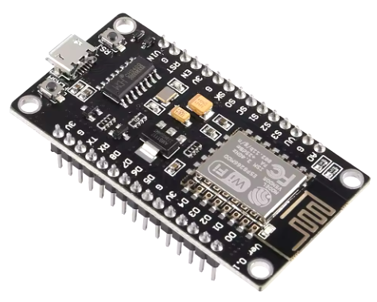 
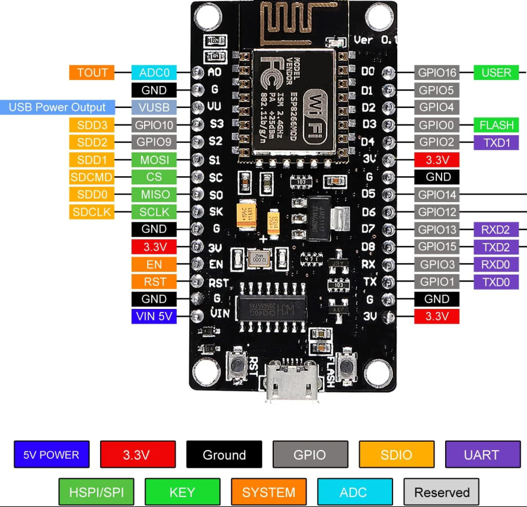
Alimentation de l'ESP : 5 Volt 500mA (200mA mini)
- Alimentation via les pins
  - VIN de ESP au +5V
  - G de ESP au -5V

Interface PiTinfo
- TXD => RXD : D7 de ESP (RXD2 GPIO13)

LED RGB
- Pin 1 -> D5 (GPIO14) de ESP
- Pin 2 -> GND
- Pin 3 -> 3V de ESP (3.3V)

## ESP32 Dev Kit (Type ESP32 WROOM DA Module) avec 4 Mo de flash (30 broches)
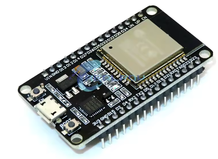 
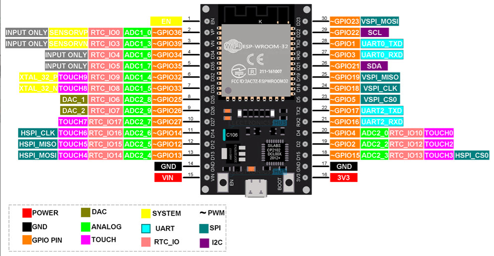
Alimentation de l'ESP : 5 Volt 500mA (200mA mini)
- Alimentation via les pins
  - VIN de ESP au +5V
  - G de ESP au -5V
- Alimentation via la prise USB
  - Alimentation possible avec un chargeur de téléphone connecté sur la prise USB 

Interface PiTinfo
  - TXD => Entrée Téléinfo GPIO 4 (affichée dans l'onglet Système de l'interface Web) 
  - LED => GPIO 12 (Wifinfo.h : #define RED_LED_PIN    12)

LED RGB
  - Pin 1 -> GPIO 18 (Wifinfo.h : #define RGB_LED_PIN    18)
  - Pin 2 -> GND
  - Pin 3 -> 3V de ESP (3.3V)

## ESP8266 Wemos Mini D1 (Type LOLIN(WEMOS D1 mini))
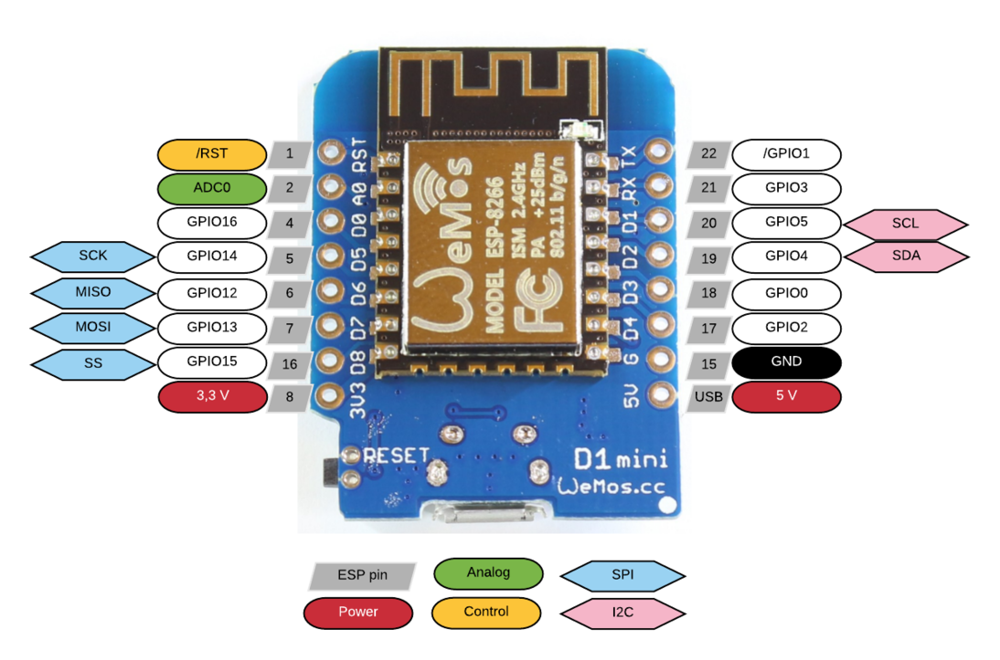
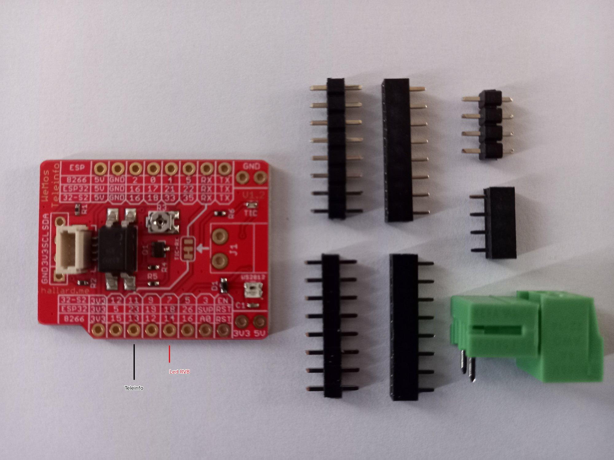
- Avec interface Wemos Teleinfo by Charles
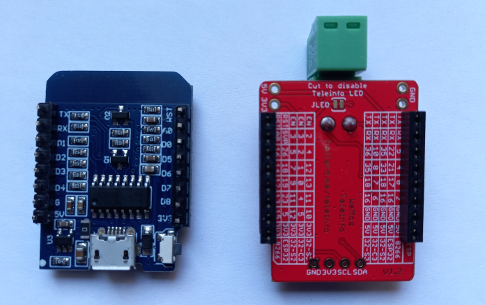
- Attension au sens (5V, TX, RX et D7 sur esp8266 gpio13)
- Souder les connecteurs femelles sur l'interface
- Souder les connecteurs males sur le Wemos Mini D1
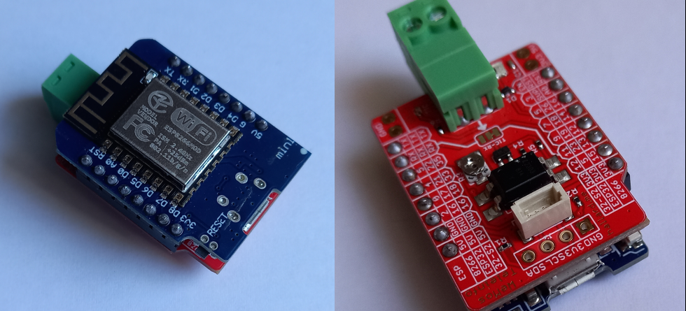

Alimentation de l'ESP : 5 Volt 500mA (200mA mini)
- Alimentation via les pins
  - 5V de ESP au +5V
  - G de ESP au -5V
- Alimentation via la prise USB
  - Alimentation possible avec un chargeur de téléphone connecté sur la prise USB 

Interface Wemos Téléinfo (par défaut envoie des données sur GPIO 13)
  - TIC-RX => Entrée Téléinfo GPIO 13 (affichée dans l'onglet Système de l'interface Web de Wifinfo)

LED RGB
- Pin 1 -> GPIO14 (D5)
- Pin 2 -> GND
- Pin 3 -> 3V de ESP (3.3V)

## ESP32 Wemos Mini D1
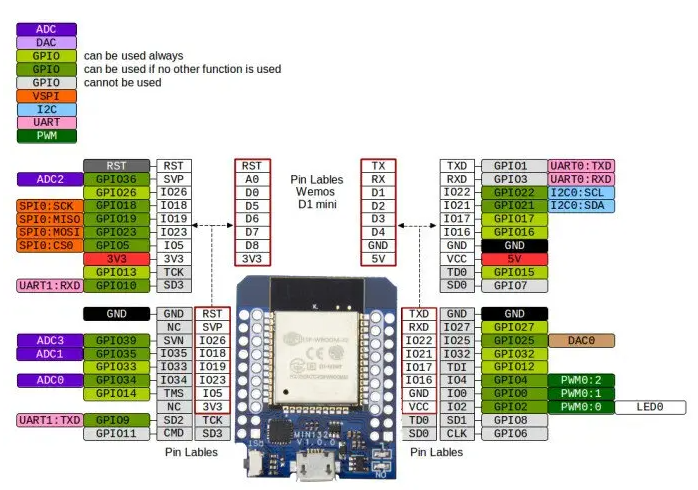
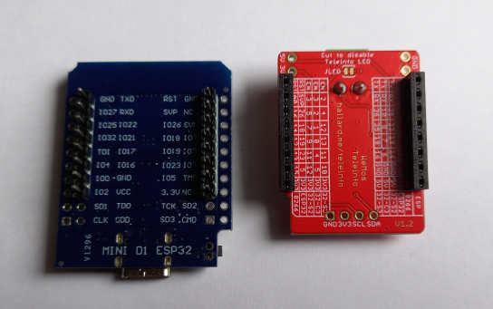
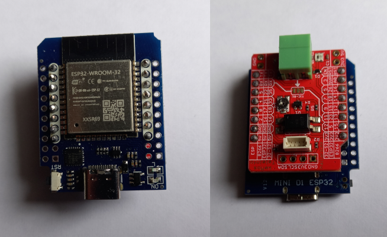

Alimentation de l'ESP : 5 Volt 500mA (200mA mini)
- Alimentation via la prise USB
  - Alimentation possible avec un chargeur de téléphone connecté sur la prise USB 

Interface Wemos Téléinfo
  - TIC-RX => Entrée Téléinfo GPIO 23 (affichée dans l'onglet Système de l'interface Web de Wifinfo)

LED RGB
- Pin 1 -> GPIO18
- Pin 2 -> GND
- Pin 3 -> 3V de ESP (3.3V)

# Hardware compatible
Wifinfo n'est pas testé pour tous les modèles ESP32 mais est censé fonctionner

L'onglet système donne l'entrée pour connecter l'interface Teleinfo

Si le module possède 3 entrées série, Serial2 est utilisée pour la réception (RX2)

Si le module possède 2 entrées série, Serial1 est utilisée pour la réception (RX1)

|          | Name | ESP32 | ESP32S2 | ESP32S3 | ESP32C2 | ESP32C3 | ESP32C6 | ESP32H2 | ESP32P4 |
|----------|------|-------|---------|---------|---------|---------|---------|---------|---------|
| UART1 RX | RX1  | 26    | 11      | 15      | 10 ?    | 4       | 4 ?     | 0 ?     | 11 ?    |
| UART1 TX | TX1  | 27    | --      | 16      | 18 ?    | --      | 5 ?     | 1 ?     | 10 ?    |
| UART2 RX | RX2  | 23    | --      | 11      | --      | --      | --      | --      | --      |
| UART2 TX | TX2  | --    | --      | --      | --      | --      | --      | --      | --      |

- Serial1 : RX1, TX1
- Serial2 : RX2, TX2
- '--' : n'existe pas
- Information extraite de .arduino15/packages/esp32/hardware/esp32/3.1.1/cores/esp32/HardwareSerial.h

# Interface compteur Linky by hallard 
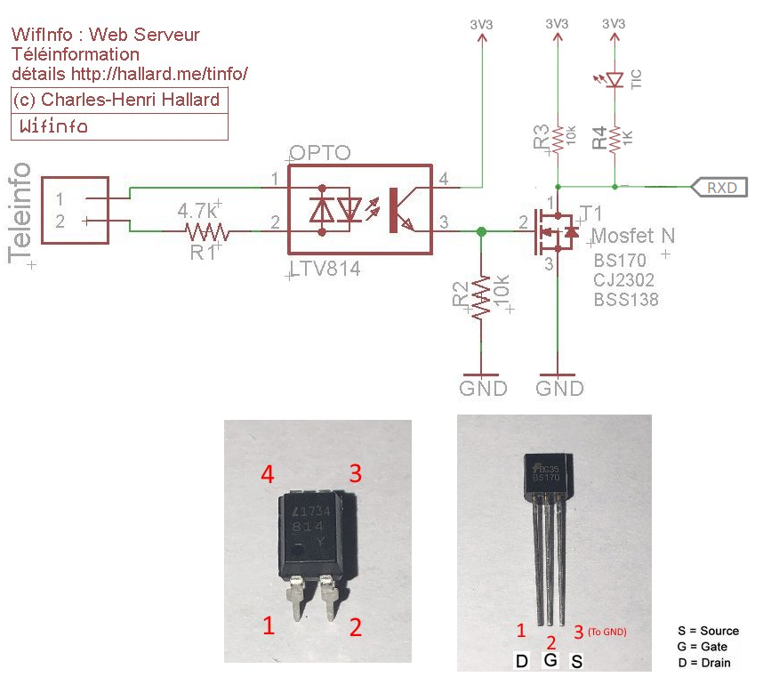
Attention, les BS170 que j'ai reçu avait un brochage inversé S-G-D (au lieu de D-G-S) ça ne fonctionnait pas !!!
- C'est reconnaissable, la tension entre Drain et Source était de 0,6V alors que la grille était à zéro.

Pour un linky en mode standard, il faut peut être passer la valeur de la résistance R1 à 1k.

Si vous ne voulez vous lancer dans la réalisation de l'interface il existe plusieurs modèles
- Faites une recherche 'PiTInfo from Charles' et choisissez celle qui correspond le mieux. Il ne vous restera plus qu'à la connecter sur la bonne entrée qui est indiquée dans l'onglet système

ESP (ESP8266 or ESP32) Input specifications (Entrée Teleinfo):
- Niveau bas : Tension inférieure à Vil (max) = 0.25 * 3.3 = 0.825V
- Niveau Haut : Tension supérieure à Vih (min) = 0.75 * 3.3 = 2.475V

Test de l'interface:
- La LED TIC doit être éteinte (Tension en Drain et Source environ 3.3 Volts)
- En reliant l'entrée 1 à GND et 2 à 3.3V la LED TIC doit s'allumer (Tension en Drain et Source environ 0 Volt)
- Avec une tension variant entre 0V et 3.3V on respecte bien les spécifications ESP

Connexions au compteur Linky (il n'y a pas de sens, on peut inverser)
- Connecter Teleinfo 1 et sur I1 du compteur
- Connecter Teleinfo 2 et sur I2 du compteur

Connexions à Serial2 de ESP32 WROOM
- GND : GND de ESP (GND) 
- +V  : 3V  de ESP (3.3V)
- RXD : Entrée Teleinfo de l'ESP

L'Entrée Teleinfo de l'ESP est affichée dans l'onglet [Système](docs/Wifinfo-systeme.png) de l'interface Web
- Compiler, téléverser le Croquis, Uploader le répertoire data,
- Aller sur l'interface Web dans l'onglet Système' : la ligne 'Entrée Téléinfo' vous donnera le GPIO à connecter

ESP32 : L'entrée Teleinfo est RX2 si Serial2 existe sinon c'est RX1 (Voir tableau ci-dessus)
- Linux voir <home_dir>.arduino15/packages/esp32/hardware/esp32/3.3.7/cores/esp32/HardwareSerial.h

ESP12E : L'entrée Teleinfo est GPIO4

# RGB LED 5mm WS2812B
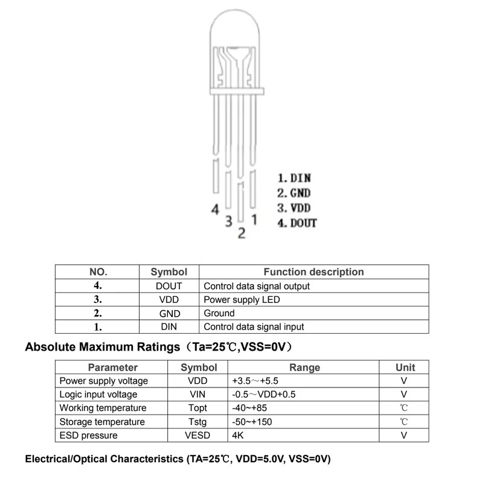
- Pin 1 -> Data : GPIO14 (D5) pour ESP8266, GPIO 14 pour ESP32)
- Pin 2 -> GND
- Pin 3 -> 3V de ESP (3.3V)

Warning : Le WS2812B est RGB mais certains sont GRB (dans ce cas il faut adapter la déclaration dans Wifinfo.ino):
- Wifinfo.ino WS2812B **RGB** :
  - NeoPixelBus<**NeoRgbFeature**, Neo400KbpsMethod> rgb_led(1, RGB_LED_PIN);
- Wifinfo.ino WS2812B **GRB**
  - NeoPixelBus<**NeoGrbFeature**, Neo400KbpsMethod> rgb_led(1, RGB_LED_PIN);
- A la mise sous tension vous devez avoir successivement la led Rouge puis Verte, puis bleue. Si ce n'est pas le cas il faut changer la déclaration de rgb_led dans Wifinfo.ino

# Compilation / Téléversement
Utiliser Arduino IDE V1.8.18 / V1.8.19
Warning : Déconnecter l'interface Linky du RX de l'ESP

- Ajout des types de carte 'ESP32-WROOM-DA Module' et 'Lolin(WEMOS) D1 mini (clone)'

  - Fichier->Preferences : URL de gestionnaire de cartes supplémentaires (virgule comme séparateur pour plusieurs URL)
    - Ajouter http://arduino.esp8266.com/stable/package_esp8266com_index.json 
    - https://espressif.github.io/arduino-esp32/package_esp32_index.json
    - Cliquer sur OK.

  - Outils->Type de carte 'xxxx'->Gestionnaire de carte
    - Filtrer esp8266
    - esp8266 by ESP8266 community v3.1.2
    - Cliquer sur Installer

  - Outils->Type de carte 'xxxx'->Gestionnaire de carte
    - Filtrer esp32
    - esp32 by Espressif Systems : Sélectionner la version **v3.1.1** (**ne pas prendre une version supérieure**)
    - Cliquer sur Installer

  - Outils-> Type de carte 'xxxx'->ESP32 Arduino
    - Sélectionner **ESP32-WROOM-DA Module** ou **Lolin(WEMOS) D1 mini (clone)**

  - Outils->Port (il faut que l'ESP soit connecté à l'ordinateur)
    - Sélectionner le port

- Paramètres de compilation
  - ESP8266 Wemos Mini D1
    - CPU Frequency : **160 Mhz**
    - Flash size : **4MB (FS 1MB / OTA :~ 1019KB)** 
  - ESP32-WROOM
    - CPU Frequency : **160 Mhz**
    - Partition scheme : **Default 4M with spiffs (1.2MB APP / 1.5MB SPIFFS)**

- Ajout Arduino ESP8266 filesystem uploader v0.5.0
  - Télécharger https://github.com/esp8266/arduino-esp8266fs-plugin/releases/download/0.5.0/ESP8266FS-0.5.0.zip
  - Décompresser l'outils dans le répertoire Arduino ( Le répertoire doit être <home_dir>/Arduino/tools/ESP8266FS/tool/esp8266fs.jar)
  - Redémarrer Arduino IDE
  - Dans le menu Outils vous devez avoir 'ESP8266 Sketch Data Upload'

- Ajout ESP32 Sketch Data Upload v2.0.7
  - Télécharger https://github.com/lorol/arduino-esp32fs-plugin/releases/download/2.0.7/esp32fs.zip
  - Décompresser l'outils dans le répertoire Arduino ( Le répertoire doit être <home_dir>/Arduino/tools/ESP32FS/tool/esp32fs.jar)
  - Redémarrer Arduino IDE
  - Dans le menu Outils vous devez avoir 'ESP32 Sketch Data Upload'
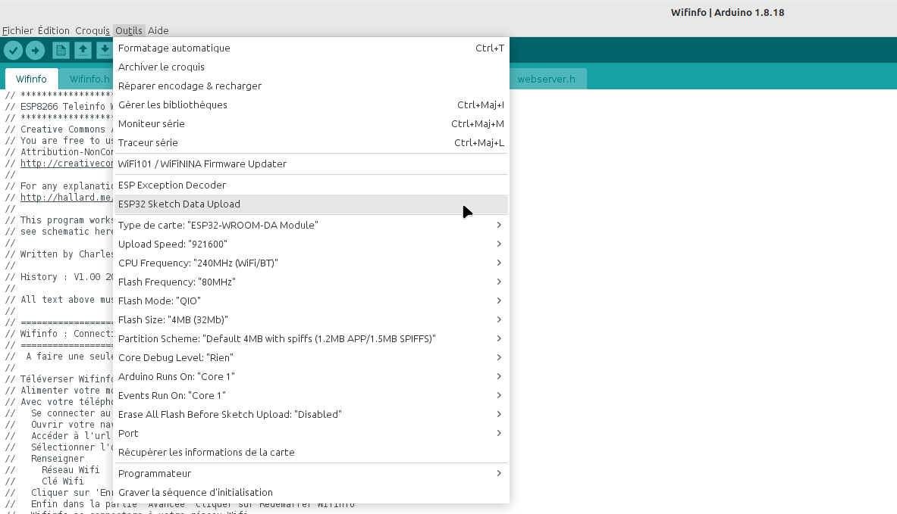

- Ajout de ESP8266LittleFS-2.6.0 (Si votre cible est un ESP8266)
  - Télécharger https://github.com/earlephilhower/arduino-esp8266littlefs-plugin/releases/download/2.6.0/ESP8266LittleFS-2.6.0.zip
  - Décompresser l'outils dans le répertoire Arduino ( répertoire qui devrait ressembler à <home_dir>/Arduino/tools/ESP8266LittleFS/tool/esp8266littlefs.jar)
  - Redémarrer Arduino IDE
  - Dans le menu Outils vous devez avoir 'ESP8266 LittleFS Data Upload'

- Ajout de la librairie LibTeleinfo
  - Depuis https://github.com/Duglof/LibTeleinfo/tree/esp32
  - Choisir Code->Download ZIP (Choisir le répertoire <home_dir>/Arduino/libraries)
  - Décompresser le ZIP dans ce répertoire

- Ajout de la librairie ESP32WebServer 
  - Depuis https://github.com/Pedroalbuquerque/ESP32WebServer
  - Choisir Code->Download ZIP (Choisir le répertoire <home_dir>/Arduino/libraries)
  - Décompresser le ZIP dans ce répertoire

- Ajout des autres librairies nécessaires
  - Syslog-master
    - Decompresser <home_dir>Arduino/libraries/LibTeleinfo/librairie/Syslog-master.zip dans <home_dir>Arduino/libraries
  - NeoPixelBus_by_Makuna V2.8.4 : l'installer depuis l'Arduino IDE
  - PubSubClient V2.8
    - Telecharger pubsubclient.zip from https://github.com/knolleary/pubsubclient/tree/master
    - Decompresser dans <home_dir>Arduino/libraries
 
- Ouvrir le projet Wifinfo
  - Fichiers->Exemples->LibTeleinfo
  - Sélectionner 'Wifinfo'

- Compilation
  - Croquis->Compiler

- Téléversement (Il faut obligatoirement ces deux actions !!!)
  - 1 - **Outils->ESP32 Sketch Data Upload** (cela téléverse le contenu du répertoire data du projet Wifinfo)
    - Choisir le format SPIFFS et cliquer sur OK
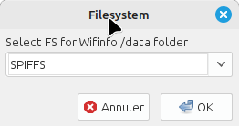
    - Si erreur 'Timed out waiting for packet header
      - Quand vous voyez “Connecting…” (ou juste avant), appuyez et maintenez le 'BOOT Button' (pb rencontré avec ESP32 WROOM 32D)
    - Si Erreur error: esptool not found (arduino ide installé sur linux mint)
      - **Ne pas prendre une version supérieure à la v5.2.0** car elle ne contiendra plus esptool.py
      - Prendre la version d'esptool V5.2.0 depuis : https://github.com/espressif/esptool/archive/refs/tags/v5.2.0.zip
      - Copier **esptool-5.2.0.zip** dans le dossier <home_dir>/.arduino15/packages/esp32/hardware/esp32/3.1.1/tools
      - Click droit sur **esptool-5.2.0.zip** et faire extraire ici
      - Renommer le dossier créé **esptool-5.2.0** en **esptool**
      - Vérification : Ouvrez une fenetre terminal
        - cd .arduino15/packages/esp32/hardware/esp32/3.1.1/tools/esptool
        - ./esptool.py
        - esptool V5.2.0 ...

  - 2 - **Croquis->Téléverser**

# Tests
## Test avec Jeedom
Jeedom V4.4.19 : Plugin Teleinfo by Noyax37 V4.8.7
Winfinfo V3.0.0 version validée Linky Mode Historique
Winfinfo V3.0.0 version validée Linky Mode Standard by Noyax37

Jeedom Plugin Teleinfo : compteur heures pleines / heures creuses
- Sur Jeedom
  - Ajouter le plugin Téléinfo
- Sur Wifinfo : Onglet configuration
  - Port de votre jeedom : 80
  - Serveur Jeedom : IP de votre Jeedom: Exemple 192.168.1.88
  - URL : /plugins/teleinfo/core/php/jeeTeleinfo.php
  - Clé API : La clé API du plugin teleinfo : Jeedom / Système / Configuration : Onglet API : Clé API : Téléinfo
  - Enregistrer
  - Redémarrer Wifinfo (Onglet Avancée)

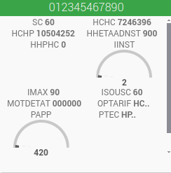

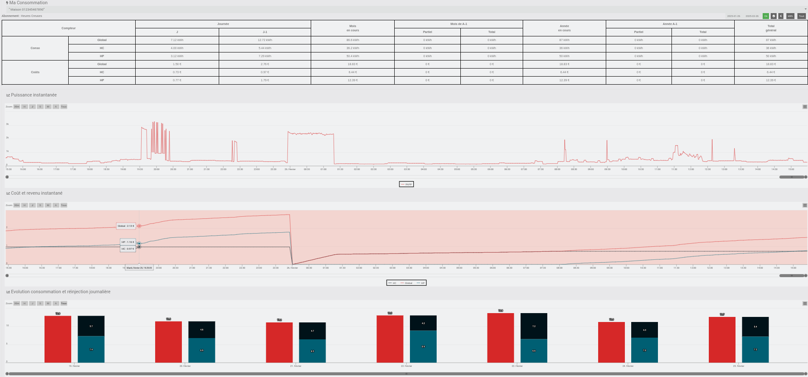

## Test Mqtt avec Home Assistant (2026.1.3)
- Sur Wifinfo:
  - Paramètre Mqtt
    - IP de votre Home Assistant: exemple 192.168.1.32
    - Fréquence : 1 minute
    - Port par défaut : 1883
    - user/password : ceux de Mqtt Mosquito
  - Paramètre système : mode historique 1200 bauds
  - Redémarrer Wifinfo
  - Aucune valeur à configurer : quel que soit votre abonnement, wifinfo envoie toutes les infos qu’il reçoit du Linky

- Sur Home Assisant:
  - Installation de Mqtt Mosquitto et création de son utilisateur
  - Ajouter dans configuration.yaml la déclaration suivante (pour un abonnement Heures Creuses)
```
# Linky : Sensor Mqtt
mqtt:
    sensor:
        # Linky : Puissance apparente PAPP 
        - state_topic: "TIC/data/PAPP"
          name: "Linky PAPP"
          unit_of_measurement: "W"
          state_class: "measurement"
          device_class: "power"
          unique_id: linky_papp

        # Linky : Intensité Instantanée 
        - state_topic: "TIC/data/IINST"
          name: "Linky IINST"
          unit_of_measurement: "A"
          state_class: measurement
          device_class: current
          unique_id: linky_iinst

        # Linky : Intensité Maximale 
        - state_topic: "TIC/data/IMAX"
          name: "Linky IMAX"
          unit_of_measurement: "A"
          state_class: measurement
          device_class: current
          unique_id: linky_imax

        # Linky : Total Heures creuses HCHC (Les index du Linky sont en WH)
        - state_topic: "TIC/data/HCHC"
          name: "Linky HCHC"
          unit_of_measurement: "Wh"
          device_class: energy
          state_class: total_increasing
          unique_id: linky_hchc
      
        # Linky : Total Heures pleines HCHP (Les index du Linky sont en WH)
        - state_topic: "TIC/data/HCHP"
          name: "Linky HCHP"
          unit_of_measurement: "Wh"
          device_class: energy
          state_class: total_increasing
          unique_id: linky_hchp

        # Linky : PTEC : Permet de savoir si l’on est en HP ou HC
        # ne pas mettre state_class: "measurement" : state_class n’est autorisé que pour des nombres (W, kWh, V, A…).
        - state_topic: "TIC/data/PTEC"
          name: "Linky Tarif"
          unique_id: linky_ptec
```
  - Redémarrer Home Assistant
  - Dans le module Energie, ajouter  (à vous d’ajuster)
  - Consommation du réseau:
    - Linky HCHC avec un prix statique à 0.1636
    - Linky HCHP avec un prix statique à 0.2081
  - Puissance du réseau:
    - Linky PAPP
  - Résultat dans la Vue Automatique en cliquant sur Linky HCHP
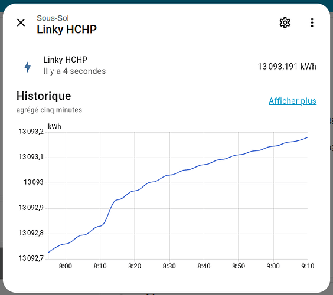
  - Résultat du module Energie Standard:
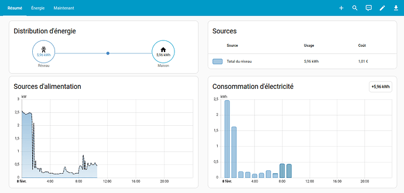
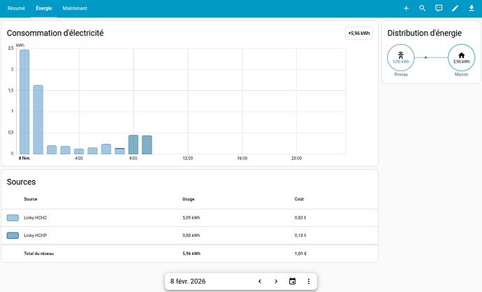


- Visualisation des données reçues par Mqtt Mosquito avec Mqtt explorer installé sur votre ordinateur personnel
  - IP de votre Home Assistant: exemple 192.168.1.32
  - Port par défaut : 1883
  - User/password : ceux de Mqtt Mosquito
  - Se connecter 
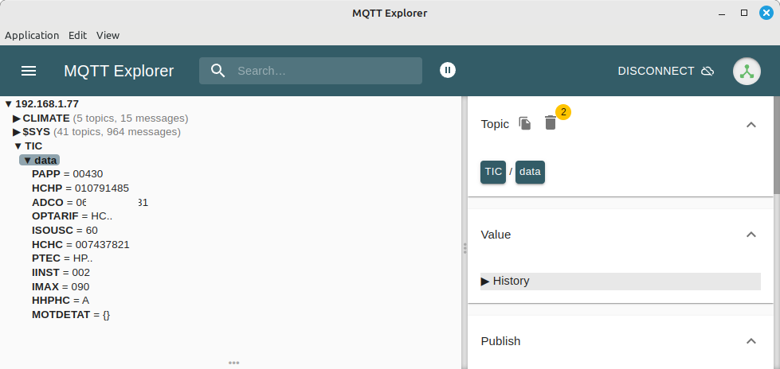

# LED RGB
Si LED RGB est coché dans Configuration / Avancé alors:

| Evènement |  LED RGB | Commentaire |
|---------|--------|---------|
| Wifi non connecté | COLOR_ORANGE | Clignotement, Timeout 5 secondes |
| Attente OTA | COLOR_MAGENTA | Cligontement, 10 fois|
| Teleinfo Ajout   | COLOR_GREEN| |
| Teleinfo Mise à jour | COLOR_MAGENTA | |

# Téléinformation
Wifinfo : Onglet Téléinformation
Linky Mode Historique en Heure Pleine/Heure Creuse
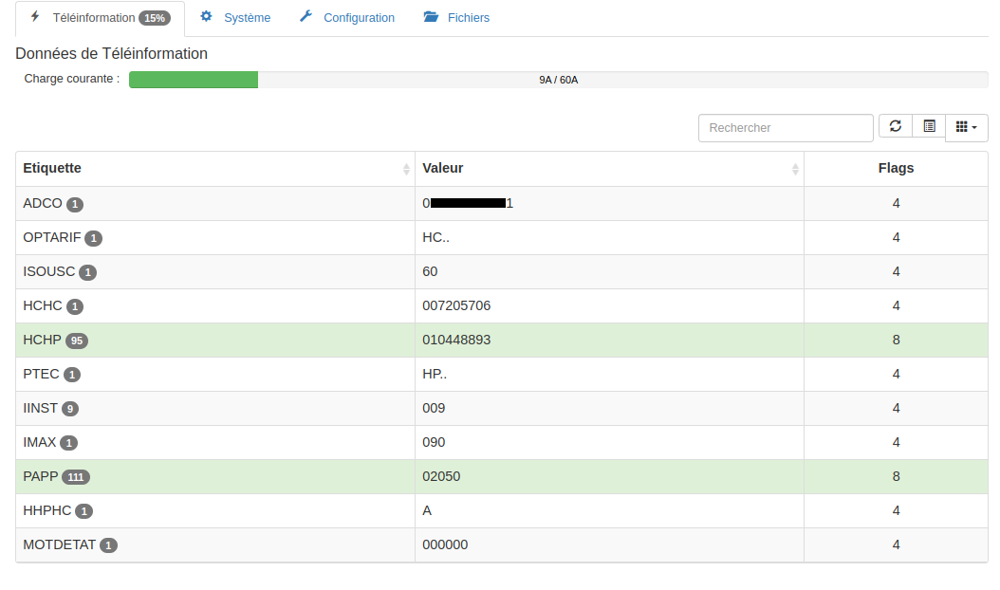

# Mise à jour via WIFI (OTA : Over-The-Air)
Wifinfo est prévu pour être mis à jour via le réseau Wifi sans avoir besoin de connecter directement la carte ESP sur le port de l'ordinateur

Mise à jour du croquis
- Il n'y a rien à modifier
- Sélectionner le port OTA dans Arduino IDE (comme ci-dessous)
- Exécuter ensuite 'Croquis/Téléverser'
- Entrer le mot de passe OTA (qui est défini dans Configuration Avancée)
- Le Croquis sera mis à jour via le réseau Wifi

Mise à jour des data (Fichiers)
- Aller sur le page de la configuration avancée de Wifinfo
- Supprimer le mote de passe OTA
- Mettre OTA port à 3232
- Sélectionner le port OTA dans Arduino IDE

- 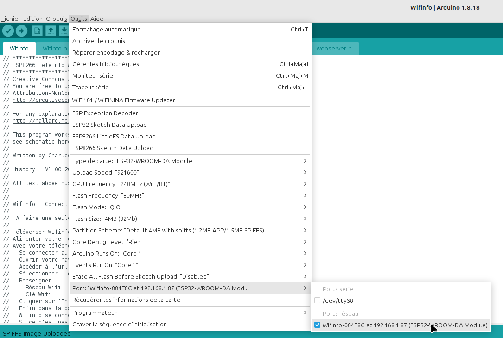 
- Exécuter ensuite 'Outils/ESP32 Sketch Data Upload', ils seront effectués via le réseau Wifi

- 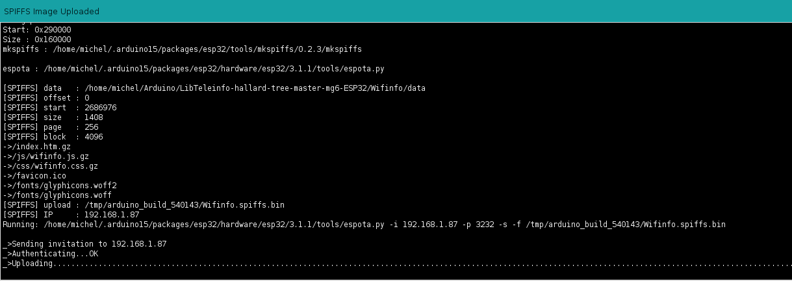
 
- Restaurer ensuite le port et le mot de passe initial pour des raisons de sécurité
 
# Debug avec Syslog
- Compiler Wifinfo avec le #define SYSLOG (Winfinfo.h)
- Configurer Wifinfo
  - Onglet Configuration
  - Déployer ‘Avancée’
  - Rsyslog serveur (IP ou Nom DNS) : Entrer l’IP de votre machine ou vous installerez le logiciel socat (Windows ou Linux) 
  - Rsyslog port : 514
- Installer socat (sur une machine de votre réseau local)
- Ouvrir une fenêtre terminal et lancer 'socat -u UDP-RECV:514 STDOUT'
  - sudo /usr/bin/socat -u UDP-RECV:514 STDOUT (exemple sous linux)
  - Le fenêtre Terminal liste alors tous les messages debug de Wifinfo
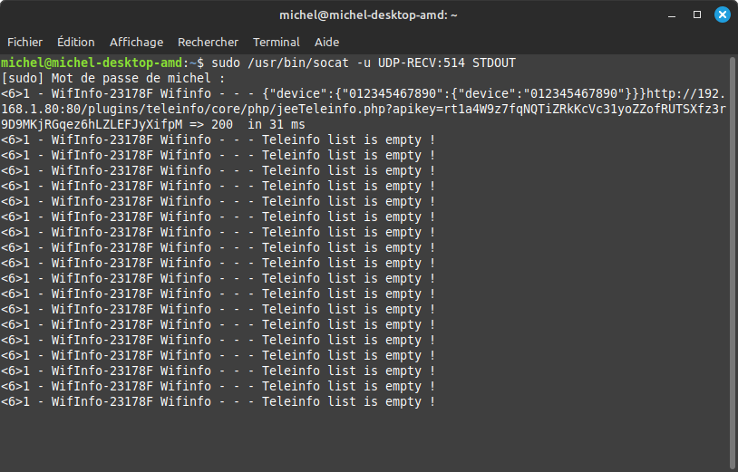

# Debug des exceptions
- Ce type de trace ne s'obtient que dans la fenêtre Outils/Moniteur série de l'IDE Arduino
- On ne l'a pas avec SYSLOG
# Exemple de message:

Stack smashing protect failure!


Backtrace: 0x40082661:0x3ffb20d0 0x4008f199:0x3ffb20f0 0x40082672:0x3ffb2110 0x400d409d:0x3ffb2130 0x400e4531:0x3ffb2190 0x400d3958:0x3ffb21b0 0x400e942c:0x3ffb2270 0x4008fe12:0x3ffb2290


ELF file SHA256: a12af395d

Rebooting...

# Outils à installer

Il faut installer ESPExceptionDecoder V2.0.3
- https://github.com/me-no-dev/EspExceptionDecoder/releases/download/2.0.3/EspExceptionDecoder-2.0.3.zip
- Télécharger le zip dans Arduino/tools
- Faire Extraite ici
- Il apparaît dans Aduino IDE 1.8.18 Outils/ESP Exception Decoder

# Utilisation
- Il faut absolument compiler votre Croquis (sinon il vous demandera de sélection un fichier elf)
- Ouvrir le fenêtre Outils/ESP Exception Decoder (qui s'ouvrira sans poser de question)
- Et coller dans cette fenêtre le message ci-dessus
- Vous obtiendrez le décodage ci-dessous
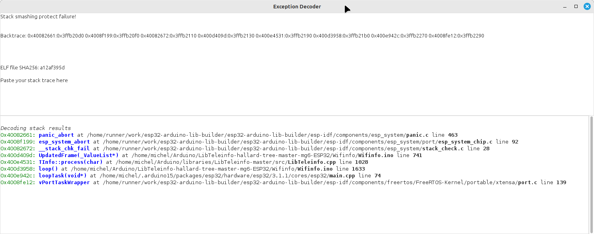
- C'est plus clair, le problème est dans Wifinfo ligne 741 !!!

# Réalisation (maquette)
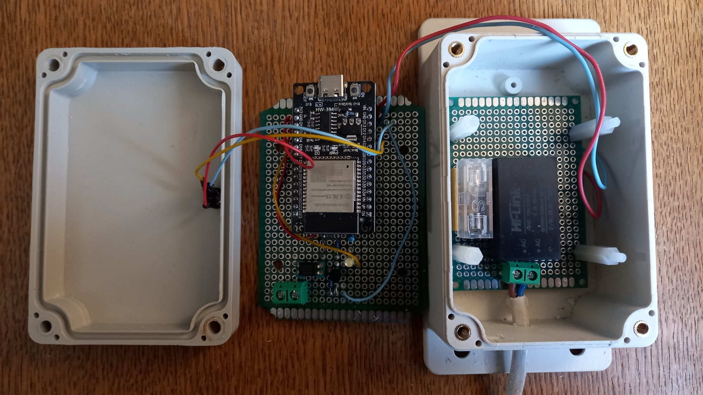

## Matériel

|  Matériel                                         |  Photo                                               | Commentaire                    |
|---------------------------------------------------|------------------------------------------------------|--------------------------------|
| Boitier étanche 100x68x50mm                       | [Boitier](docs/Materiel-Boitier.png)                 |                                |
| Câble + prise secteur                             |                                                      |                                |
| 4 vis 3mmx15mm                                    |                                                      |                                |
| 4 colonnettes 20mm mâle femelle                   |                                                      |                                |
| 4 écrous plastique 3mm                            |                                                      |                                |
| Support fusible 5x20mm avec couvercle transparent | [Support fusible](docs/Materiel-support-fusible.png) |                                |
| Fusible 5x20mm 0.2A                               |                                                      |                                |
| PCB double face vert 50x70mm                      | [PCB 50x70](docs/Materiel-pcb.png)                   |                                |
| PCB double face vert 60x80mm                      | [PCB 60x80](docs/Materiel-pcb.png)                   |                                |
| Support de LED 5mm                                |                                                      |                                |
| Bornier 5,08 deux pôles (x2)                      | [Bornier 5.08 2P](docs/Materiel-bornier-5.08-2P.png) |                                |
| Divers : fil électrique                           |                                                      |                                |
| Divers : soudure D 1mm                            |                                                      |                                |
| Gaine thermo rétractable 2mm                      |                                                      |                                |
| -                                                 |                                                      |                                |
| ESP32 WROOM 32S 30 broches (ici USB-C)            |                                                      |                                |
| Hi-Link HLK-PM01 AC 100-240V 5V DC 0.6A           |                                                      |                                |
| Opto-coupleur LTV-814 DIP-4                       |                                                      |                                |
| BS170 TO-92                                       |                                                      | Attention au sens Drain Source |
| LED RVB puce Ws2812 5mm ronde claire              |                                                      | Les miennes étaient GRB        |
| 2 x Résistance 10K 1/4w                           |                                                      |                                |
| 2 x Résistance 1K 1/4w                            |                                                      |                                |
| 1 LED 3mm blanche                                 |                                                      |                                |

- L'utilisation d'un multimètre est conseillée
- Il n'y a pas de sens pour I1 et I2 : on peut les inverser

## Fonctionnement des LEDS

- Test préliminaires :
  - Si I1 et I2 ne sont pas connectés, la LED blanche de l'interface doit être éteinte
  - En connectant I1 au +3.3V et I2 au GND, la LED blanche de l'interface doit s'allumer

- La LED RVB cliqnote Rouge, puis Vert, puis Bleu à la mise sous tension
  - Si ce n'est pas dans cet ordre changer la déclaration de la led dans Wifinfo.ino
  - Mais c'est sans importance pour le fonctionnement
- La LED blanche de l'interface est presque toujours allumée avec de brèves extinctions
- La LED RVB fait ensuite plusieurs clignotement Violets (initialisation OTA)
- La LED RVB fait ensuite un clignotement à chaque réception de trame (toutes les 3 ou 4 secondes en mode historique).

 
