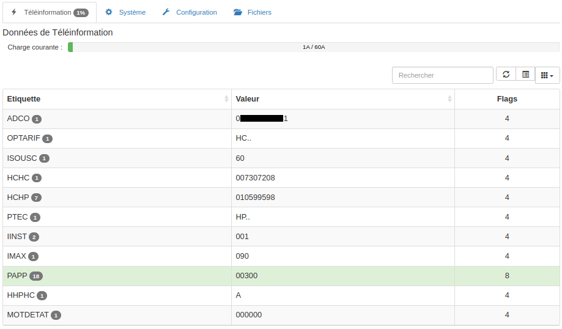
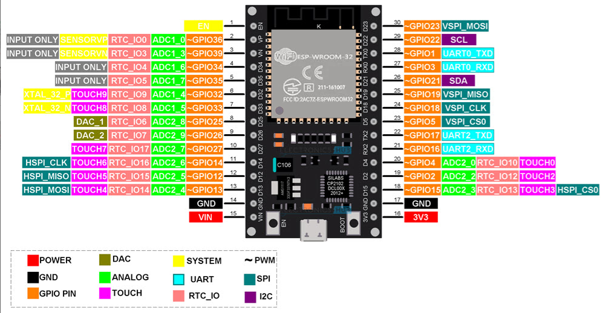
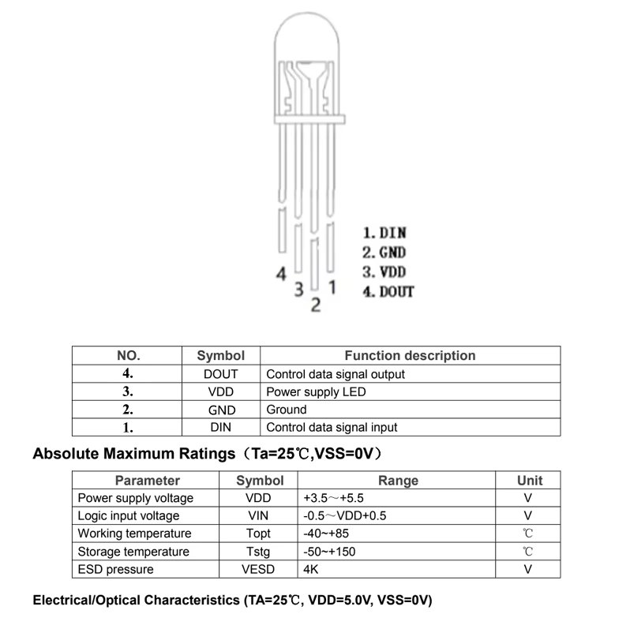
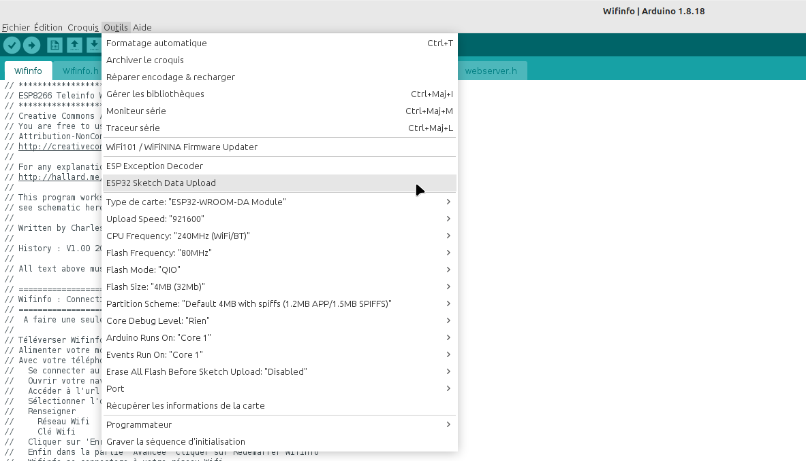
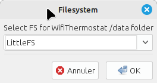
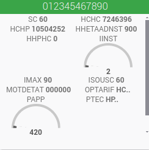
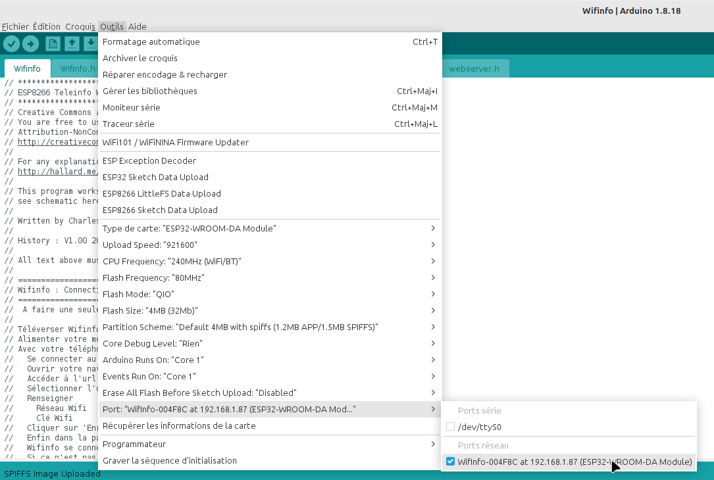
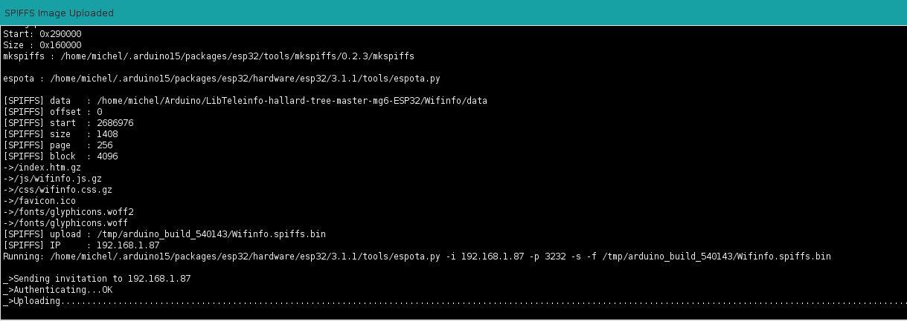
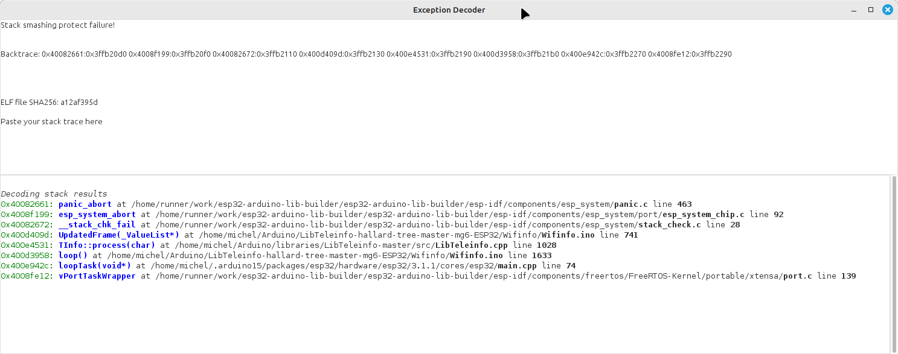

# Wifinfo 

# Teleinfo Universal Library
This is a fork of Teleinfo Universal Library for the ESP8266 MCU
This is a generic Teleinfo French Meter Measure Library
- Initial Github source : <https://github.com/hallard/LibTeleinfo>
- Modified Github source : <https://github.com/Doume/LibTeleinfo>
- Modified Github source : <https://github.com/theGressier/LibTeleinfo/tree/syslog>
- Modified Github source : <https://github.com/Duglof/LibTeleinfo>
- Modified Github source : <https://github.com/Davcail/LibTeleinfo-syslog-mqtt>

Sélection du mode (TINFO_MODE_HISTORIQUE par défaut):
  - TInfo.init(TINFO_MODE_HISTORIQUE); 
   ou 
  - TInfo.init(TINFO_MODE_STANDARD); 

exemples/Arduino_Softserial_Etiquette : Affiche des informations de téléinformation reçue étiquette par étiquette.

exemples/Arduino_Softserial_Blink : Affiche des informations de téléinformation reçue trame par trame avec clignotement LED court/long si les données ont été modifiés.

# Wifinfo pour ESP32 (mais aussi ESP8266)

  exemples/Wifinfo

Le serveur Web Wifinfo est connecté:
  - en Wifi à votre réseau local
  - au compteur Linky via l'interface OPTO à I1 et I2
  - A une alimentation 5V via le connecteur USB (micro USB ou USB-C ou autre si l'ESP choisi n'a pas de prise USB) 

Wifinfo est compatible avec tous les contrats car il ne fait pas de filtrage sur les données reçues ( BASE, HPHC, TEMPO, etc)

Wifinfo est compatible Linky Mode Historique et Linky Mode Standard (à configurer dans l'interfece Web Onglet Configuration : Section Avancée)

Wifinfo peut utiliser le système de fichier SPIFFS ou LittleFS
  - Option de compilation Wifinfo.h : #define WIFINFO_FS_LittleFS
 
Wifinfo permet par configuration d'activer les fonctions suivantes:
  - Envoie périodique des données au plugin Teleinfo de votre Jeedom
  - Envoie périodique des données au serveur emoncms
  - Envoie de données à un serveur MQTT (Jeedom, HomeAssistant ou autre)
  - Envoie de données à un serveur web via une requète http GET
    - les tags %HCHP% %HCHC% %PAPP% %IINST% etc sont remplacés par leur valeur

Wifinfo est aussi un serveur json qui permet:
  - Retourner les données de téléinformation du Linky (http://192.168.1.x/json)
  - Retourner les données système ((http://192.168.1.x/system.json))

Wifinfo dispose d'une interface d'administation 
  - [Téléinformation](docs/Wifinfo-Teleinformation.png): Visualisation des données du linky (ADCO, HCHC, ...)
  - Configuration: [Réseau Wifi](docs/Wifinfo-configuration-generale.png), [Mqtt](docs/Wifinfo-configuration-mqtt.png), [Emoncms](docs/Wifinfo-configuration-emoncms.png), [Jeedom](docs/Wifinfo-configuration-jeedom.png), [Http Request](docs/Wifinfo-configuration-http-request.png), [Avancée](docs/Wifinfo-configuration-avancee.png)
  - [Système](docs/Wifinfo-systeme.png) : Affichage des informations système ( Version, Réseau, Erreurs, Options de compilation, Mémoire)
  - [Fichiers](docs/Wifinfo-fichiers.png) : Affichage des informations du système de fichiers (Liste, Taille, Espace libre)
 
  - Linky mode Historique et mode Standard dans l'onglet Configuration Avancée (Redémarrer Wifinfo après le changement)
  - Compatible jeedom v4 / clé API plugin Teleinfo 64 caractères
  - Beta version de mqtt

Wifinfo : Configuration Wifi

Depuis votre téléphone portable :
- Se connecter au réseau Wifinfo-XXXXXX
- Navigateur (chrome ou autre) url : http://192.168.4.1
- Sélectionner l'onglet Configuration
- Réseau Wifi : Mettre le SSID
- Clé Wifi    : Mettre le mot de passe de votre réseau Wifi
- Clicker sur Enregistrer
- Déployer Avancée
- Cliquer sur Redémarrer Wifinfo
- Wifinfo se connectera à votre réseau Wifi
- Accéder à votre box pour connaître sa nouvelle adresse IP

# Modification par dugolf (vVersion 3.1.0)
  - Ajout support système de fichiers LittleFS ou SPIFFS par option de compilation
    - Wifinfo.h : #define WIFINFO_FS_LittleFS

# Modification par dugolf (version 3.0.0)
- Compilation pour ESP12E (ESP8266) et pour ESP32 (ESP32 WROOM32)
- Mise à jour de Readme.md pour ESP32
- Correction débordement de pile char buff[32] trop petit
- Set Wifi connect timeout to 10 seconds
- Correction pour que le LED RGB ou GRB fonctionne
- Eviter les débordements de logbuffer de SYSLOG en cas de message de Debug
- Eviter les débordements de waitbuffer de SYSLOG en cas de message de Debug

# Modification par dugolf (version 2.0.0)
- Merge avec https://github.com/hallard/LibTeleinfo/tree/master
  - Integration nouvelle LibTeleinfo compatible mode Historique et mode Standard
    - Presque identique à https://github.com/arendst/Tasmota/tree/development/lib/lib_div/LibTeleinfo
- Ajout Configuration Linky Mode dans l'onglet Configuration Avancée
  - Radio button Linky Mode Historique et Linky Mode Standard dans l'onglet Configuration Avancée
  - Sélectionner inky Mode Historique ou Linky Mode Standard
  - Cliquer sur Redémarrer Wifinfo pour que le changement soit pris en compte
- Affichage sur la page web dans l'onglet Système
  - Les options de compilation
  - Les compteurs d'erreur (checksumerror,framesizeerror,frameformaterror,frameinterrupted)
- Ajout d'une beta version de MQTT
   - Envoie de messages de log démarrage (Version, Adresse IP, Date Heure)
   - Envoie immédiat des données de Téléinformations ajoutées ou modifiées (DataCallback()

# Modifications par dugolf (version 1.0.8)
- Wifinfo.h : #define WIFINFO_VERSION "1.0.8"
- library.json : "version": "1.0.8"
- library.properties : version=1.0.8
- Teleinfo clé api 64 caractères
  - config.h : #define CFG_JDOM_APIKEY_SIZE  64
  - data : index.htm.gz : index.htm : id="jdom_apikey" : maxlength="64"
  - Wifinfo.ino : char buff[300] //To format debug strings but also use to format jeedom request
- Correction erreurs de compilation (LibTeleinfo.h / LibTeleinfo.cpp)
  - void TInfo::process (char c); : retourne void
  - void TInfo::clearBuffer(); : retourne void
  - ValueList * TInfo::valueAdd; : return NULL à la fin de la méthode
- Warning C++ conversion const char * en char * (Wifinfo.ino)
  - add void Myprint(const char *msg)

# Modifications par theGressier (version 1.0.7)
- Modification de l'envoi des données à Jeedom suite à la mise à jour du plugin Teleinfo en v4 (changement API, POST JSON)
- Reconnect WiFi automatically after incident

# Modifications par Doume (version 1.0.6) branche 'syslog' :

- Permettre l'envoi des messages de debugging à un serveur rsyslog du réseau local

   les paramètres peuvent être configurés via l'interface Web, onglet 'Configuration'
   panel 'Avancée'
   
   Il suffit de laisser le paramètre 'Syslog host' vide, pour désactiver cette fonction.
   Les envois sur le réseau utilisent le protocole UDP pour alimenter le serveur
   distant
   
   Pour compiler avec l'option SYSLOG, vous devrez installer la librairie Syslog-master.zip
   qui se trouve dans le répertoire 'librairie', dans votre environnement Arduino IDE
			
# Modifications par Doume (version 1.0.5a) branche 'static' :

- Ajout de la gestion d'un contact sec, dont l'état peut être remonté vers Domoticz
     exemple : le compteur EDF est souvent près du portail, donc on peut notifier
     			l'état ouvert/fermé du portail en utilisant Wifinfo
			
# Modifications par Doume (version 1.0.5) branche 'static' :

- Add support for request /emoncms.json

        return a json list formated to interface emoncms server from a 3rd party 
        That allow to don't activate emoncms http client inside Wifinfo module
	
- Add possibility to compile a version of sketch for module not connected to EDF counter

        Activate #define SIMU into Wifinfo.h, to obtain a version which will create
         2 variables and update one of them each second, to verify package
	 
- Add a check on variable names, and force a reinit of LibTeleinfo interface if an
  alteration is detected (each restart is counted, and displayed in 'system' page )
  
- Change library LibTeleinfo.cpp, to don't use anymore malloc/free system APIs

		Variables are now stored in static table, allocated on start
		
			50 entries max, name length 16 bytes max, value length 16 bytes max
			
		To use this library version :
		
			First, backup your old version of LibTeleinfo....
			
			copy files src/LibTeleinfo.cpp and src/LibTeleinfo.h into your Arduino
			environment (generally ~/Arduino/libraries/LibTeleinfo-master/src )
			before to compile sketch

# Added features :
- Add possibility to configure HttpRequest to send parameters/values to Domoticz
- Add all possible variable as listed below : 
- Add some informations to 'System' page, like Wifi link quality, Wifi network name, and MAC address

Ces différents messages donnent les indications suivantes en fonction de l’abonnement souscrit (Base, HP/HC, EJP, Tempo):
- N° d’identification du compteur : ADCO (12 caractères)
- Option tarifaire (type d’abonnement) : OPTARIF (4 car.)
- Intensité souscrite : ISOUSC ( 2 car. unité = ampères)
- Index si option = base : BASE ( 9 car. unité = Wh)
- Index heures creuses si option = heures creuses : HCHC ( 9 car. unité = Wh)
- Index heures pleines si option = heures creuses : HCHP ( 9 car. unité = Wh)
- Index heures normales si option = EJP : EJP HN ( 9 car. unité = Wh)
- Index heures de pointe mobile si option = EJP : EJP HPM ( 9 car. unité = Wh)
- Index heures creuses jours bleus si option = tempo : BBR HC JB ( 9 car. unité = Wh)
- Index heures pleines jours bleus si option = tempo : BBR HP JB ( 9 car. unité = Wh)
- Index heures creuses jours blancs si option = tempo : BBR HC JW ( 9 car. unité = Wh)
- Index heures pleines jours blancs si option = tempo : BBR HP JW ( 9 car. unité = Wh)
- Index heures creuses jours rouges si option = tempo : BBR HC JR ( 9 car. unité = Wh)
- Index heures pleines jours rouges si option = tempo : BBR HP JR ( 9 car. unité = Wh)
- Préavis EJP si option = EJP : PEJP ( 2 car.) 30mn avant période EJP
- Période tarifaire en cours : PTEC ( 4 car.)
- Couleur du lendemain si option = tempo : DEMAIN
- Intensité instantanée : IINST ( 3 car. unité = ampères)
- Avertissement de dépassement de puissance souscrite : ADPS ( 3 car. unité = ampères) (message émis uniquement en cas de dépassement effectif)
  - Valeurs données pour ISOUSC = 60 A)
  - Dépassement jusqu’à 1.1 x ISOUSC (inférieur à 66 A) alors cela ne coupera jamais.
  - Dépassement entre 1.1 et 1.4 ISOUSC (66A -> 84A) alors cela mettra 250 secondes avant de couper.
  - Dépassement entre 1.4 et 2.5 ISOUSC (84 A -> 150 A) alors cela va couper en 40 secondes.
  - Dépassement supérieur à 2.5 ISOUSC (plus de 150 A) alors la coupure sera instantanée.
- Intensité maximale : IMAX ( 3 car. unité = ampères)
- Puissance apparente : PAPP ( 5 car. unité = Volt.ampères)
- Groupe horaire si option = heures creuses ou tempo : HHPHC (1 car.)
- Mot d’état (autocontrôle) : MOTDETAT (6 car.)

# Hardware de test
ESP32 Dev Kit (type WROOM 32) avec 4 Mo de flash (30 broches)
 

Alimentation de l'ESP : 5 Volt 500mA (200mA mini)
- VIN de ESP au +
- G de ESP au -

Alimentation possible avec un charger de téléphone connecté sur la prise USB 

# Hardware compatible
Wifinfo n'est pas testé pour tous les modèles ESP32 mais est censé fonctionner

L'onglet système donne l'entrée pour connecter l'interface Teleinfo

Si le module possède 3 entrées série, Serial2 est utilisée pour la reception (RX2)

Si le module possède 2 entrées série, Serial1 est utilisée pour la reception (RX1)

|          | Name | ESP32 | ESP32S2 | ESP32S3 | ESP32C2 | ESP32C3 | ESP32C6 | ESP32H2 | ESP32P4 |
|----------|------|-------|---------|---------|---------|---------|---------|---------|---------|
| UART1 RX | RX1  | 26    | 4       | 15      | 10      | 18      | 4       | 0       | 11      |
| UART1 TX | TX1  | 27    | 5       | 16      | 18      | 19      | 5       | 1       | 10      |
| UART2 RX | RX2  | 4     | --      | 19      | --      | --      | --      | --      | --      |
| UART2 TX | TX2  | 25    | --      | 20      | --      | --      | --      | --      | --      |

- Serial1 : RX1, TX1
- Serial2 : RX2, TX2
- '--' : n'existe pas
- Information extraitent de .arduino15/packages/esp32/hardware/esp32/3.1.1/cores/esp32/HardwareSerial.h

# Interface compteur Linky by hallard 

Attention, les BS170 que j'ai reçu avait un brochage inversé S-G-D (au lieu de D-G-S) ça ne fonctionnait pas !!!
- C'est reconnaissable, la tension entre Drain et Source était de 0,6V alors que la grille était à zéro.

Pour un linky en mode standard, il faut peut être passer la valeur de la résistance R1 à 1k.

ESP (ESP8266 or ESP32) Input specifications (Entrée Teleinfo):
- Niveau bas : Tension inférieure à Vil (max) = 0.25 * 3.3 = 0.825V
- Niveau Haut : Tension supérieure à Vih (min) = 0.75 * 3.3 = 2.475V

Test de l'interface:
- La LED TIC doit être éteinte (Tension en Drain et Source environ 3.3 Volts)
- En reliant l'entrée 1 à GND et 2 à 3.3V la LED TIC doit s'allumer (Tension en Drain et Source environ 0 Volt)
- Avec une tension variant entre 0V et 3.3V on respecte bien les spécifications ESP

Connexions au compteur Linky (il n'y a pas de sens, on peut inverser)
- Connecter Teleinfo 1 et sur I1 du compteur
- Connecter Teleinfo 2 et sur I2 du compteur

Connexions à Serial2 de ESP32 WROOM
- GND : GND de ESP (GND) 
- +V  : 3V  de ESP (3.3V)
- RXD : Entrée Teleinfo de l'ESP

L'Entrée Teleinfo de l'ESP est affichée dans l'onglet [Système](docs/Wifinfo-systeme.png) de l'interface Web
- Compiler, téléverser le Croquis, Uploader le répertoire data,
- Aller sur l'interface Web dans l'onglet Système' : la ligne 'Entrée Téléinfo' vous donnera le GPIO à connecter

ESP32 : L'entrée Teleinfo est RX2 si Serial2 existe sinon c'est RX1 (Voir tableau ci-dessus)
- Linux voir <home_dir>.arduino15/packages/esp32/hardware/esp32/3.1.1/cores/esp32/HardwareSerial.h

ESP12E : L'entrée Teleinfo est GPIO4

# RGB LED 5mm WS2812B

- Pin 1 -> GPIO14 (D5 pour ESP8266, D14 pour ESP32)
- Pin 2 -> GND
- Pin 3 -> 3V de ESP (3.3V)

Warning : Le WS2812B est RGB mais certains sont GRB (dans ce cas il faut adapter la déclaration dans Wifinfo.ino):
- Wifinfo.ino WS2812B RGB :
  - NeoPixelBus<NeoRgbFeature, Neo400KbpsMethod> rgb_led(1, RGB_LED_PIN);
- Wifinfo.ino WS2812B GRB
  - NeoPixelBus<NeoGrbFeature, Neo400KbpsMethod> rgb_led(1, RGB_LED_PIN);
- A la mise sous tension vous devez avoir successivement la led Rouge puis Verte, puis bleue. Si ce n'est pas le cas il faut changer la déclaration de rgb_led dans Wifinfo.ino

# Compilation / Téléversement
Utiliser Arduino IDE V1.8.18
Warning : Déconnecter l'interface Linky du RX de l'ESP

- Ajout du type de carte 'ESP32-WROOM-DA Module'

  - Fichier->Preferences : URL de gestionnaire de cartes supplémentaires (virgule comme séparateur pour plusieurs URL)
    - Ajouter http://arduino.esp8266.com/stable/package_esp8266com_index.json 
    - https://espressif.github.io/arduino-esp32/package_esp32_index.json
    - Cliquer sur OK.

  - Outils->Type de carte 'xxxx'->Gestionnaire de carte
    - Filtrer esp8266
    - esp8266 by ESP8266 community v3.1.2
    - Cliquer sur Installer

  - Outils->Type de carte 'xxxx'->Gestionnaire de carte
    - Filtrer esp32
    - esp32 by Espressif Systems v3.1.1
    - Cliquer sur Installer

  - Outils-> Type de carte 'xxxx'->ESP32 Arduino
    - Sélectionner ESP32-WROOM-DA Module

  - Outils->Port (il faut que ESP32 soit connecté à l'ordinateur)
    - Sélectionner le port

- Ajout ESP32 Sketch Data Upload v2.0.7 (Si votre cible est un ESP32)
  - Télécharger https://github.com/lorol/arduino-esp32fs-plugin/releases/download/2.0.7/esp32fs.zip
  - Décompresser l'outils dans le répertoire Arduino ( répertoire qui devrait ressembler à <home_dir>/Arduino/tools/ESP32FS/tool/esp8266fs.jar)
  - Redémarrer Arduino IDE
  - Dans le menu Outils vous devez avoir 'ESP32 Sketch Data Upload'

- Ajout de ESP8266LittleFS-2.6.0 (Si votre cible est un ESP8266)
  - Télécharger https://github.com/earlephilhower/arduino-esp8266littlefs-plugin/releases/download/2.6.0/ESP8266LittleFS-2.6.0.zip
  - Décompresser l'outils dans le répertoire Arduino ( répertoire qui devrait ressembler à <home_dir>/Arduino/tools/ESP8266LittleFS/tool/esp8266littlefs.jar)
  - Redémarrer Arduino IDE
  - Dans le menu Outils vous devez avoir 'ESP8266 LittleFS Data Upload'

- Ajout de la librairie LibTeleinfo
  - Depuis https://github.com/Duglof/LibTeleinfo/tree/esp32
  - Choisir Code->Download ZIP (Choisir le répertoire <home_dir>/Arduino/libraries)
  - Décompresser le ZIP dans ce répertoire

- Ajout de la librairie ESP32WebServer 
  - Depuis https://github.com/Pedroalbuquerque/ESP32WebServer
  - Choisir Code->Download ZIP (Choisir le répertoire <home_dir>/Arduino/libraries)
  - Décompresser le ZIP dans ce répertoire

- Ajout des autres librairies nécessaires
  - Syslog-master
    - Decompresser <home_dir>Arduino/libraries/LibTeleinfo/librairie/Syslog-master.zip dans <home_dir>Arduino/libraries
  - NeoPixelBus_by_Makuna V2.8.3 : l'installer depuis l'Arduino IDE
 
- Ouvrir le projet Wifinfo
  - Fichiers->Exemples->LibTeleinfo
  - Sélectionner 'Wifinfo'

- Compilation
  - Croquis->Compiler

- Téléversement (Il faut obligatoirement ces deux actions !!!)
  - Outils->ESP32 Sketch Data Upload (cela téléverse le contenu du répertoire data du projet Wifinfo) (Si votre cible est un ESP32)
    - Choisir le format LittleFS et cliquer sur OK

    - Si Erreur error: esptool not found
      - Ouvrir le dossier <home_dir>/.arduino15/packages/esp8266/hardware/esp8266/3.1.2/tools
      - Click droit sur le dossier esptool et faire copier
      - Ouvrir le dossier <home_dir>/.arduino15/packages/esp32/hardware/esp32/3.1.1/tools
      - Click droit et faire coller

  - Outils->ESP8255 LittleFS Data Upload (cela téléverse le contenu du répertoire data du projet Wifinfo) (Si votre cible est un ESP8266)

 - Croquis->Téléverser

# Tests
Jeedom V4.4.19 : Plugin Teleinfo by Noyax37 V4.8.7
Winfinfo V3.0.0 version validée Linky Mode Historique
Winfinfo V3.0.0 version validée Linky Mode Standard by Noyax37

Jeedom Plugin Teleinfo : compteur heures pleines / heures creuses

# LED RGB
Si LED RGB est coché dans Configuration / Avancé alors:

| Evènement |  LED RGB | Commentaire |
|---------|--------|---------|
| Wifi non connecté | COLOR_ORANGE | Clignotement, Timeout 5 secondes |
| Attente OTA | COLOR_MAGENTA | Cligontement, 10 fois|
| Teleinfo Ajout   | COLOR_GREEN| |
| Teleinfo Mise à jour | COLOR_MAGENTA | |

# Téléinformation
Wifinfo : Onglet Téléinformation
Linky Mode Standard en Heure Pleine/Heure Creuse

# Mise à jour via WIFI (OTA : Over-The-Air)
Wifinfo est prévu pour être mis à jour via le réseau Wifi sans avoir besoin de connecter directement la carte ESP sur le port de l'ordinateur

Il faut effectuer les opérations suivantes:
- Aller sur le page de la configuration avancée de Wifinfo
- Supprimer le mote de passe OTA
- Mettre OTA port à 3232
- Sélectionner le port OTA dans Arduino IDE

-  
- Exécuter ensuite 'Croquis/Téléverser' ou 'Outils/ESP32 Sketch Data Upload', ils seront effectués via le réseau Wifi

- 
 
- Restaurer ensuite le port et le mot de passe initial pour des raisons de sécurité
 
# Debug avec Syslog
- Compiler Wifinfo avec le #define SYSLOG (Winfinfo.h)
- Configurer Wifinfo
  - Onglet Configuration
  - Déployer ‘Avancée’
  - Rsyslog serveur (IP ou Nom DNS) : Entrer l’IP de votre machine ou vous installerez le logiciel socat (Windows ou Linux) 
  - Rsyslog port : 514
- Installer socat (sur une machine de votre réseau local)
- Ouvrir une fenêtre terminal et lancer 'socat -u UDP-RECV:514 STDOUT'
  - sudo /usr/bin/socat -u UDP-RECV:514 STDOUT (exemple sous linux)
  - Le fenêtre Terminal liste alors tous les messages debug de Wifinfo

# Debug des exceptions
- Ce type de trace ne s'obtient que dans la fenêtre Outils/Moniteur série de l'IDE Arduino
- On ne l'a pas avec SYSLOG
# Exemple de message:

Stack smashing protect failure!

Backtrace: 0x40082661:0x3ffb20d0 0x4008f199:0x3ffb20f0 0x40082672:0x3ffb2110 0x400d409d:0x3ffb2130 0x400e4531:0x3ffb2190 0x400d3958:0x3ffb21b0 0x400e942c:0x3ffb2270 0x4008fe12:0x3ffb2290

ELF file SHA256: a12af395d

Rebooting...

# Outils à installer

Il faut installer ESPExceptionDecoder V2.0.3
- https://github.com/me-no-dev/EspExceptionDecoder/releases/download/2.0.3/EspExceptionDecoder-2.0.3.zip
- Télécharger le zip dans Arduino/tools
- Faire Extraite ici
- Il apparaît dans Aduino IDE 1.8.18 Outils/ESP Exception Decoder

# Utilisation
- Il faut absolument compiler votre Croquis (sinon il vous demandera de sélection un fichier elf)
- Ouvrir le fenêtre Outils/ESP Exception Decoder (qui s'ouvrira sans poser de question)
- Et coller dans cette fenêtre le message ci-dessus
- Vous obtiendrez le décodage ci-dessous

- C'est plus clair, le problème est dans Wifinfo ligne 741 !!!

